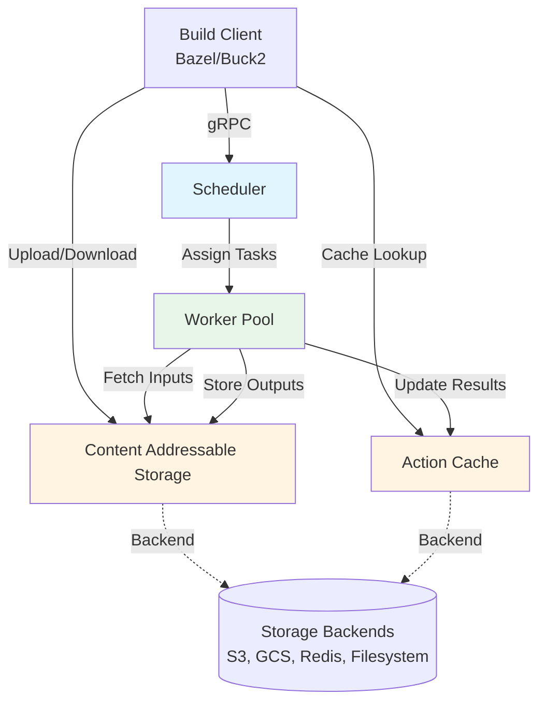
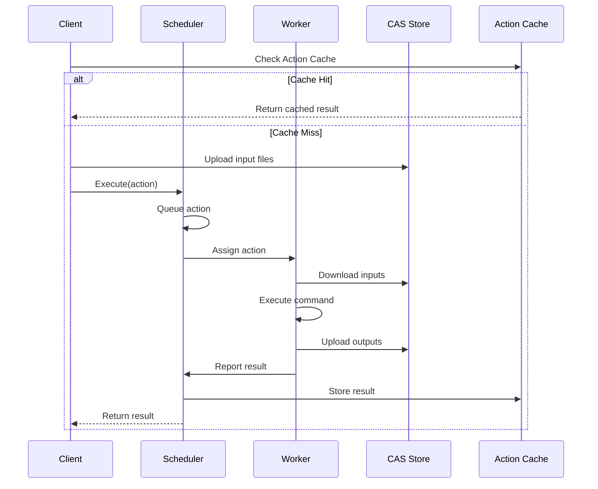

NativeLink is a high-performance, distributed build cache and remote execution system designed to accelerate software compilation and testing. The system follows the [Remote Execution API v2](https://github.com/bazelbuild/remote-apis) protocol and provides a modular architecture that scales from single-machine setups to large distributed deployments.

## Architecture Overview

NativeLink consists of three primary components that work together to provide caching and remote execution capabilities:



## Core Components

### Build Clients

Build tools like Bazel, Buck2, Goma, and Reclient interact with NativeLink through the Remote Execution API:

- Submit build actions to the scheduler
- Upload input files to the Content Addressable Storage (CAS)
- Query the Action Cache (AC) for previously computed results
- Download output artifacts from CAS

### Schedulers

The scheduler is responsible for managing the execution lifecycle of build actions:

<Tabs>
  <Tab title="Simple Scheduler">
    The primary scheduler implementation that handles action queuing, worker matching, and task distribution.
    
    **Key Features:**
    - Platform property-based worker matching
    - Configurable allocation strategies (LRU/MRU)
    - Action timeout and retry logic
    - Worker health monitoring
    
    **Configuration:** See [schedulers.rs:88-169](~/workspace/source/nativelink-config/src/schedulers.rs)
  </Tab>
  
  <Tab title="Cache Lookup Scheduler">
    A wrapper scheduler that checks the Action Cache before forwarding uncached actions to a nested scheduler.
    
    **Use Case:** Avoid executing actions that have already been computed.
  </Tab>
  
  <Tab title="Property Modifier Scheduler">
    Modifies platform properties of actions before forwarding to a nested scheduler.
    
    **Use Case:** Add, remove, or replace platform properties for routing or compatibility.
  </Tab>
  
  <Tab title="GRPC Scheduler">
    Forwards requests to a remote scheduler via gRPC.
    
    **Use Case:** Federated deployments or local caching with remote execution.
  </Tab>
</Tabs>

### Workers

Worker nodes execute build actions in isolated environments:

- Connect to the scheduler and advertise their capabilities via **platform properties**
- Download action inputs from CAS
- Execute commands in controlled environments
- Upload outputs back to CAS
- Report execution results to the scheduler

**Worker Capabilities:**
- Multi-action concurrency (configurable `max_inflight_tasks`)
- Resource management (CPU, memory, disk)
- Precondition scripts for dynamic resource checks
- Graceful draining and shutdown

### Storage Backends

NativeLink provides a flexible storage abstraction supporting multiple backends and composition strategies. See [Stores](/concepts/stores) for details.

## Data Flow

### Remote Execution Flow



### Build Cache Flow

When a build tool performs a build:

1. **Hash Computation**: Compute action digest from inputs, command, and platform properties
2. **Cache Check**: Query Action Cache with digest
3. **Cache Hit**: Download outputs from CAS and skip execution
4. **Cache Miss**: Execute locally or remotely, then populate cache

## Deployment Patterns

<CardGroup cols={2}>
  <Card title="Single-Node Setup" icon="server">
    All components run on a single machine. Ideal for local development and CI runners.
    
    - Scheduler + Worker + Storage on one node
    - In-memory or filesystem storage
    - Minimal configuration
  </Card>
  
  <Card title="Distributed Cluster" icon="network-wired">
    Components distributed across multiple machines for scalability.
    
    - Dedicated scheduler nodes
    - Worker pool (10s-1000s of nodes)
    - Shared cloud storage (S3, GCS)
    - Redis for metadata
  </Card>
  
  <Card title="Hybrid Cloud" icon="cloud">
    Local caching with remote execution.
    
    - Local CAS/AC stores
    - GRPC Scheduler forwarding to cloud
    - FastSlow store for cache tiers
  </Card>
  
  <Card title="Multi-Region" icon="globe">
    Geographically distributed deployment.
    
    - Regional schedulers and workers
    - Shared global CAS (S3/GCS)
    - Compression for network efficiency
  </Card>
</CardGroup>

## Communication Protocols

NativeLink implements the following Remote Execution API v2 services:

### Execution Service
- `Execute` - Submit actions for execution
- `WaitExecution` - Monitor execution progress

### Content Addressable Storage Service
- `FindMissingBlobs` - Check blob existence
- `BatchUpdateBlobs` - Upload small blobs
- `BatchReadBlobs` - Download small blobs
- `GetTree` - Retrieve directory trees

### ByteStream Service
- `Read` - Stream blob downloads
- `Write` - Stream blob uploads

### Action Cache Service
- `GetActionResult` - Retrieve cached results
- `UpdateActionResult` - Store action results

### Capabilities Service
- `GetCapabilities` - Query server capabilities

## Platform Properties

Platform properties enable fine-grained worker matching:

<Accordion title="Property Types">
  <AccordionItem title="Minimum">
    Requires workers to have at least the specified value (for numeric properties like `cpu_count`).
  </AccordionItem>
  
  <AccordionItem title="Exact">
    Requires exact string match (e.g., `cpu_arch: arm64`).
  </AccordionItem>
  
  <AccordionItem title="Priority">
    Informational only, used for worker preference (not yet fully implemented).
  </AccordionItem>
  
  <AccordionItem title="Ignore">
    Allows actions to request properties without requiring workers to have them.
  </AccordionItem>
</Accordion>

**Example Configuration:**
```json
{
  "supported_platform_properties": {
    "cpu_count": "minimum",
    "cpu_arch": "exact",
    "OSFamily": "exact"
  }
}
```

## Configuration Files

NativeLink uses JSON5 configuration files that define:

- **Stores**: CAS and AC backend configurations
- **Schedulers**: Task scheduling and worker management
- **Workers**: Execution capabilities and resources
- **Servers**: gRPC service endpoints

See the [configuration examples](https://github.com/TraceMachina/nativelink/tree/main/nativelink-config/examples) for reference deployments.

## Performance Characteristics

<Note>
  NativeLink is trusted in production to handle **over 1 billion requests per month** for customers including Samsung.
</Note>

**Key Performance Features:**
- Content-addressed deduplication eliminates redundant storage
- Incremental builds reuse cached artifacts
- Parallel remote execution distributes workload
- Store composition (compression, dedup, fast/slow tiers)
- Efficient binary protocols (gRPC + protobuf)

## Metrics and Observability

NativeLink provides extensive metrics and tracing:

- **Prometheus Metrics**: Component-level performance data
- **OpenTelemetry Tracing**: Distributed request tracing
- **Origin Events**: Action lifecycle tracking
- **Health Endpoints**: Service status monitoring

## Next Steps

<CardGroup cols={3}>
  <Card title="Build Cache" icon="database" href="/concepts/build-cache">
    Learn how build caching accelerates builds
  </Card>
  <Card title="Remote Execution" icon="bolt" href="/concepts/remote-execution">
    Understand distributed task execution
  </Card>
  <Card title="Storage Backends" icon="hard-drive" href="/concepts/stores">
    Explore storage options and composition
  </Card>
</CardGroup>
