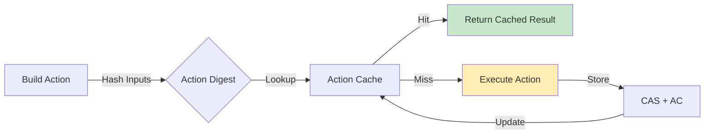
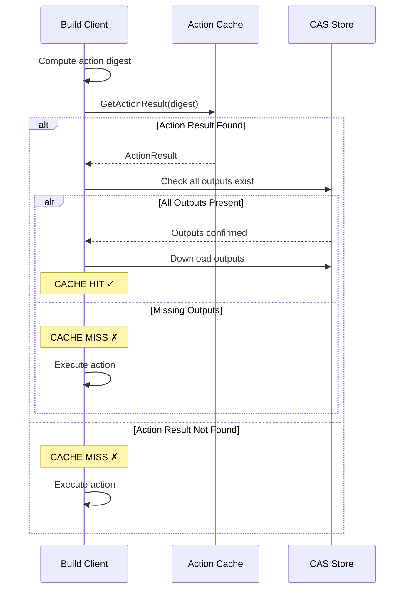

Build caching is one of NativeLink's core features that dramatically reduces build times by storing and reusing results from previous builds. When a build action is requested, NativeLink checks if an identical action has been executed before and returns the cached result instead of re-executing.

## How Build Caching Works

The build cache operates on the principle of **content-addressable storage** where every build artifact is identified by a cryptographic hash of its content.



### Action Digest Computation

An **Action Digest** uniquely identifies a build action and is computed from:

1. **Command**: The exact command to execute (e.g., `gcc -c file.c -o file.o`)
2. **Input Files**: Content hashes of all input files and directories
3. **Environment Variables**: Specified environment variables
4. **Platform Properties**: Execution requirements (OS, architecture, etc.)
5. **Timeout**: Execution timeout configuration

<Info>
  If any of these inputs change, the action digest changes, resulting in a cache miss.
</Info>

### Cache Lookup Process



## Content Addressable Storage (CAS)

The **Content Addressable Storage** (CAS) is where all build artifacts are stored, indexed by their content hash.

### Digest-Based Addressing

Every blob in CAS is identified by a `DigestInfo`:

```rust
pub struct DigestInfo {
    pub hash: [u8; 32],      // SHA-256 or BLAKE3 hash
    pub size_bytes: u64,     // Size of the content
}
```

**Supported Hash Functions:**
- **SHA-256**: Industry standard, widely compatible
- **BLAKE3**: Faster alternative with parallel hashing

<Tabs>
  <Tab title="SHA-256">
    Default hash function used by most build tools.
    
    ```json
    {
      "default_digest_hash_function": "sha256"
    }
    ```
  </Tab>
  
  <Tab title="BLAKE3">
    High-performance hash function with better parallelism.
    
    ```json
    {
      "default_digest_hash_function": "blake3"
    }
    ```
    
    <Warning>
      Ensure all clients and workers use the same hash function.
    </Warning>
  </Tab>
</Tabs>

### Deduplication

Content addressing provides automatic deduplication:

- **Identical files** share the same digest and are stored only once
- **Saves storage space** especially for common dependencies
- **Reduces network transfer** when artifacts already exist in CAS

<Note>
  Example: If 100 build actions all include the same `stdlib.h`, it's stored only once in CAS.
</Note>

## Action Cache (AC)

The **Action Cache** maps action digests to their execution results.

### ActionResult Structure

An `ActionResult` contains:

```protobuf
message ActionResult {
  repeated OutputFile output_files = 1;
  repeated OutputDirectory output_directories = 2;
  int32 exit_code = 3;
  bytes stdout_digest = 4;
  bytes stderr_digest = 5;
  google.protobuf.Duration execution_duration = 6;
}
```

**Key Fields:**
- **Output Files/Directories**: Digests of produced artifacts
- **Exit Code**: Command return code
- **Stdout/Stderr**: Digests of captured output
- **Execution Metadata**: Duration, worker info

### Cache Validation

NativeLink ensures cache integrity through **Completeness Checking**:

<Accordion title="Completeness Checking Store">
  When enabled, the `CompletenessCheckingSpec` wrapper verifies that all output digests referenced in an `ActionResult` actually exist in the CAS before returning a cache hit.
  
  ```json
  {
    "completeness_checking": {
      "backend": {
        "filesystem": { ... }
      },
      "cas_store": {
        "ref_store": { "name": "CAS_MAIN_STORE" }
      }
    }
  }
  ```
  
  <Info>
    **Recommended** for AC stores to prevent returning incomplete cache entries.
  </Info>
</Accordion>

## Cache Hit Optimization Strategies

### 1. Deterministic Builds

Ensure builds are **deterministic** to maximize cache hits:

<CardGroup cols={2}>
  <Card title="Use Relative Paths" icon="folder">
    Avoid absolute paths in compiler flags that vary between machines.
  </Card>
  <Card title="Fixed Timestamps" icon="clock">
    Remove timestamp dependencies from build outputs.
  </Card>
  <Card title="Sorted Inputs" icon="sort">
    Process inputs in consistent order (e.g., sorted file lists).
  </Card>
  <Card title="Hermetic Environments" icon="box">
    Isolate builds from system-specific dependencies.
  </Card>
</CardGroup>

### 2. Fine-Grained Actions

Break builds into **smaller, focused actions**:

- Compile individual source files separately
- Link as a separate action
- Generate headers in dedicated actions

**Benefit**: Changing one source file only invalidates that file's action, not the entire build.

### 3. Input Root Minimization

Include only **necessary inputs** in the action:

```json
// ❌ Bad: Includes entire source tree
{
  "input_root_digest": "<digest-of-entire-repo>"
}

// ✅ Good: Includes only required files
{
  "input_root_digest": "<digest-of-src-file-and-headers>"
}
```

## Cache Storage Backends

NativeLink supports various storage backends for CAS and AC:

<Tabs>
  <Tab title="Memory">
    **Ultra-fast** in-memory cache.
    
    **Use Case:** Development, small projects, fast local cache tier
    
    **Limitations:** Volatile, limited by RAM
    
    ```json
    {
      "memory": {
        "eviction_policy": {
          "max_bytes": "10gb"
        }
      }
    }
    ```
  </Tab>
  
  <Tab title="Filesystem">
    **Persistent** disk-based storage.
    
    **Use Case:** Local persistent cache, single-node deployments
    
    ```json
    {
      "filesystem": {
        "content_path": "/var/cache/nativelink/cas",
        "temp_path": "/var/cache/nativelink/tmp",
        "eviction_policy": {
          "max_bytes": "100gb"
        }
      }
    }
    ```
  </Tab>
  
  <Tab title="S3 / GCS">
    **Cloud storage** for distributed teams.
    
    **Use Case:** Multi-machine clusters, CI/CD pipelines
    
    ```json
    {
      "experimental_cloud_object_store": {
        "provider": "aws",
        "region": "us-east-1",
        "bucket": "my-build-cache"
      }
    }
    ```
  </Tab>
  
  <Tab title="Redis">
    **Fast remote cache** for small artifacts.
    
    **Use Case:** Metadata storage, small blob cache
    
    **Limitations:** Object size limits (typically 256-512 MB)
    
    ```json
    {
      "redis_store": {
        "addresses": ["redis://localhost:6379"]
      }
    }
    ```
  </Tab>
</Tabs>

## Multi-Tier Caching

Combine storage backends for optimal performance:

```json
{
  "fast_slow": {
    "fast": {
      "memory": {
        "eviction_policy": { "max_bytes": "5gb" }
      }
    },
    "slow": {
      "experimental_cloud_object_store": {
        "provider": "aws",
        "bucket": "build-cache"
      }
    }
  }
}
```

**How it Works:**
1. **Read**: Check fast tier (memory), fallback to slow tier (S3)
2. **Write**: Write to both tiers simultaneously
3. **Promotion**: Slow tier hits are cached in fast tier

<Info>
  This pattern provides local speed with cloud persistence.
</Info>

## Cache Eviction Policies

Control cache size with eviction policies:

```json
{
  "eviction_policy": {
    "max_bytes": "100gb",        // Evict when size exceeds
    "evict_bytes": "10gb",       // Evict until 90gb (low watermark)
    "max_seconds": 604800,       // Evict after 7 days
    "max_count": 1000000         // Evict when item count exceeds
  }
}
```

**Eviction Strategy**: Least Recently Used (LRU)

## Zero-Byte File Handling

NativeLink optimizes for common cases:

<Accordion title="Special Zero-Byte Digests">
  Empty files have well-known digests:
  
  - **SHA-256**: `e3b0c44298fc1c149afbf4c8996fb92427ae41e4649b934ca495991b7852b855`
  - **BLAKE3**: `af1349b9f5f9a1a6a0404dea36dcc9499bcb25c9adc112b7cc9a93cae41f3262`
  
  These are often handled specially to avoid unnecessary storage/transfer.
</Accordion>

## Cache Verification

The `VerifySpec` wrapper validates uploads:

```json
{
  "verify": {
    "backend": { ... },
    "verify_size": true,    // Check size matches digest
    "verify_hash": true     // Recompute and verify hash
  }
}
```

<Warning>
  **Recommendation**:
  - **CAS**: Enable both `verify_size` and `verify_hash`
  - **AC**: Disable both (action results are not content-addressed)
</Warning>

## Cache Statistics

Monitor cache effectiveness:

**Key Metrics:**
- **Cache Hit Rate**: Percentage of actions served from cache
- **Cache Size**: Total bytes stored
- **Eviction Rate**: How often items are evicted
- **Download/Upload Volume**: Network transfer savings

<Note>
  A well-configured cache can achieve **80-95% hit rates** for incremental builds.
</Note>

## Best Practices

1. **Use Completeness Checking** on AC stores to ensure cache integrity
2. **Enable Verification** on CAS uploads to catch corrupt data early
3. **Size Partitioning** to separate small and large artifacts
4. **Compression** for network-backed stores to reduce transfer costs
5. **Monitor Cache Metrics** to tune eviction policies
6. **Shared Caches** across teams to maximize reuse

## Next Steps

<CardGroup cols={2}>
  <Card title="Storage Backends" icon="database" href="/concepts/stores">
    Deep dive into store types and composition
  </Card>
  <Card title="Remote Execution" icon="bolt" href="/concepts/remote-execution">
    Learn how actions are executed remotely
  </Card>
</CardGroup>
