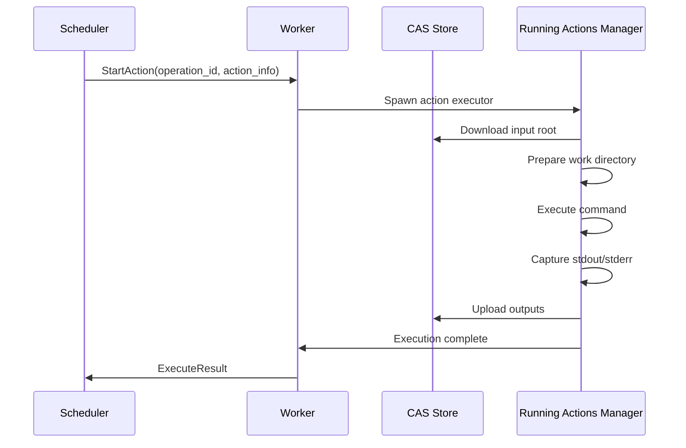

Remote Execution is NativeLink's ability to distribute build and test tasks across a pool of worker machines, enabling massive parallelization and offloading computational burden from developer workstations.

## Overview

Instead of running all build tasks locally, remote execution allows build tools to:

1. **Upload inputs** to a shared Content Addressable Storage (CAS)
2. **Submit actions** to a scheduler
3. **Execute on workers** with matching capabilities
4. **Download outputs** from CAS

```mermaid
graph TB
    subgraph Client Machine
        Build[Build Tool<br/>Bazel/Buck2]
    end
    
    subgraph NativeLink Cluster
        Sched[Scheduler]
        CAS[CAS Store]
        
        subgraph Worker Pool
            W1[Worker 1<br/>Linux x86_64]
            W2[Worker 2<br/>Linux ARM64]
            W3[Worker 3<br/>macOS x86_64]
        end
    end
    
    Build -->|1. Upload inputs| CAS
    Build -->|2. Execute(action)| Sched
    Sched -->|3. Assign task| W1
    W1 -->|4. Fetch inputs| CAS
    W1 -->|5. Upload outputs| CAS
    W1 -->|6. Report result| Sched
    Sched -->|7. Return result| Build
    Build -->|8. Download outputs| CAS
    
    style Sched fill:#e1f5ff
    style CAS fill:#fff4e1
    style W1 fill:#e8f5e9
    style W2 fill:#e8f5e9
    style W3 fill:#e8f5e9
```

## Benefits of Remote Execution

<CardGroup cols={2}>
  <Card title="Massive Parallelism" icon="bolt">
    Execute hundreds or thousands of tasks simultaneously across a worker pool.
  </Card>
  <Card title="Consistent Environments" icon="check">
    All builds run in controlled, hermetic environments ensuring reproducibility.
  </Card>
  <Card title="Resource Offloading" icon="cloud-arrow-up">
    Free up local CPU, memory, and disk for other tasks.
  </Card>
  <Card title="Faster Iteration" icon="forward-fast">
    Large builds that take hours locally can complete in minutes.
  </Card>
</CardGroup>

## Execution Lifecycle

### 1. Action Submission

The build client creates an `Action` protobuf message:

```protobuf
message Action {
  Digest command_digest = 1;        // Hash of Command proto
  Digest input_root_digest = 2;     // Root directory of inputs
  Duration timeout = 3;              // Max execution time
  bool do_not_cache = 4;            // Skip action cache
  repeated Platform.Property platform = 5;  // Execution requirements
}
```

**Key Components:**
- **Command**: What to execute (program, arguments, environment)
- **Input Root**: Merkle tree of all input files/directories
- **Platform Properties**: Worker requirements (OS, CPU architecture, etc.)
- **Timeout**: Maximum allowed execution time

### 2. Scheduler Queueing

The scheduler receives the action and:

1. **Validates** the action is well-formed
2. **Checks Action Cache** (if caching enabled)
3. **Queues** the action awaiting a suitable worker
4. **Monitors** progress and handles timeouts

<Info>
  Actions are queued in the order received, but workers may pull from the queue based on availability and platform matching.
</Info>

### 3. Worker Matching

The scheduler matches actions to workers based on **platform properties**:

```mermaid
graph LR
    A[Queued Action<br/>cpu_arch: arm64<br/>OSFamily: linux] --> M{Match Workers}
    
    W1[Worker 1<br/>cpu_arch: x86_64<br/>OSFamily: linux] -.x|No Match| M
    W2[Worker 2<br/>cpu_arch: arm64<br/>OSFamily: linux] -->|Match!| M
    W3[Worker 3<br/>cpu_arch: arm64<br/>OSFamily: darwin] -.x|No Match| M
    
    M --> Assign[Assign to Worker 2]
    
    style W2 fill:#c8e6c9
    style W1 fill:#ffcdd2
    style W3 fill:#ffcdd2
```

**Matching Rules** (configured in scheduler):

<Tabs>
  <Tab title="Exact Match">
    Worker must have the **exact** property value.
    
    ```json
    {
      "supported_platform_properties": {
        "cpu_arch": "exact",
        "OSFamily": "exact"
      }
    }
    ```
    
    **Example**: Action with `cpu_arch: arm64` only runs on workers with `cpu_arch: arm64`.
  </Tab>
  
  <Tab title="Minimum Match">
    Worker must have **at least** the property value (numeric comparison).
    
    ```json
    {
      "supported_platform_properties": {
        "cpu_count": "minimum"
      }
    }
    ```
    
    **Example**: Action requiring `cpu_count: 8` can run on workers with 8, 16, or 32 cores.
  </Tab>
  
  <Tab title="Priority Match">
    Informational property, does not restrict worker selection.
    
    ```json
    {
      "supported_platform_properties": {
        "pool": "priority"
      }
    }
    ```
  </Tab>
</Tabs>

### 4. Worker Execution

Once assigned, the worker:



**Execution Steps:**

1. **Precondition Check**: Run optional script to verify worker capabilities
2. **Input Download**: Fetch all input files from CAS into working directory
3. **Environment Setup**: Set environment variables, create output directories
4. **Command Execution**: Run the command with timeout and resource monitoring
5. **Output Capture**: Collect stdout, stderr, and exit code
6. **Output Upload**: Hash and upload all output files to CAS
7. **Result Reporting**: Send `ActionResult` back to scheduler

<Accordion title="Working Directory Isolation">
  Each action executes in a **clean, isolated directory**:
  
  - No leftover files from previous actions
  - Inputs materialized from CAS
  - Outputs collected after execution
  - Directory deleted after completion
  
  This ensures **hermetic execution** where actions cannot interfere with each other.
</Accordion>

### 5. Result Collection

The scheduler receives the `ActionResult`:

```protobuf
message ActionResult {
  repeated OutputFile output_files = 1;
  repeated OutputDirectory output_directories = 2;
  int32 exit_code = 3;
  bytes stdout_digest = 4;
  bytes stderr_digest = 5;
  ExecutedActionMetadata execution_metadata = 6;
}
```

The result is:
- **Stored in Action Cache** (if caching enabled)
- **Returned to client** via gRPC stream
- **Used to update operation status** for `WaitExecution` subscribers

## Worker Configuration

Workers are configured to advertise their capabilities and resource limits.

### Platform Properties

Declare worker capabilities:

```json
{
  "platform_properties": {
    "cpu_arch": "x86_64",
    "OSFamily": "linux",
    "cpu_count": "16",
    "memory_gb": "64",
    "pool": "production"
  }
}
```

### Resource Limits

```json
{
  "max_inflight_tasks": 8,           // Max concurrent actions
  "timeout": "1200s",                 // Default action timeout
  "upload_timeout": "600s",          // Max time to upload outputs
  "temp_path": "/tmp/nativelink"     // Scratch space
}
```

<Warning>
  Set `max_inflight_tasks` based on CPU cores and memory to avoid resource exhaustion.
</Warning>

### Precondition Scripts

Dynamically check worker readiness:

```json
{
  "precondition_script": "/usr/local/bin/check-resources.sh"
}
```

**Use Cases:**
- Check available disk space
- Verify required tools are installed
- Ensure GPU is available
- Confirm license server connectivity

<Note>
  Precondition scripts run **before** accepting each action. If the script fails (non-zero exit), the worker rejects the action.
</Note>

## Scheduler Configuration

Schedulers manage the action queue and worker pool.

### Simple Scheduler

The primary scheduler implementation:

```json
{
  "simple": {
    "supported_platform_properties": {
      "cpu_arch": "exact",
      "OSFamily": "exact",
      "cpu_count": "minimum"
    },
    "allocation_strategy": "least_recently_used",
    "worker_timeout_s": 5,
    "client_action_timeout_s": 60,
    "max_job_retries": 3
  }
}
```

**Configuration Options:**

<Accordion title="Allocation Strategy">
  <AccordionItem title="Least Recently Used (LRU)">
    Prefer workers that haven't run tasks recently.
    
    **Benefit**: Distributes load evenly, keeps all workers active.
  </AccordionItem>
  
  <AccordionItem title="Most Recently Used (MRU)">
    Prefer workers that recently ran tasks.
    
    **Benefit**: Keeps inputs cached in worker's local storage, reduces downloads.
  </AccordionItem>
</Accordion>

### Worker Timeout

```json
{
  "worker_timeout_s": 5
}
```

Remove workers from pool if no keepalive received within this duration.

<Info>
  Workers send periodic keepalive messages to signal they're still alive. If a worker crashes or loses network connectivity, it's automatically removed after the timeout.
</Info>

### Action Timeout

```json
{
  "client_action_timeout_s": 60,
  "max_action_executing_timeout_s": 300
}
```

- **client_action_timeout_s**: Mark action failed if no client update (for multi-stage operations)
- **max_action_executing_timeout_s**: Max time an action can execute without progress updates

### Retry Logic

```json
{
  "max_job_retries": 3
}
```

If an action fails with internal errors or timeouts, retry up to this many times on different workers.

<Warning>
  Actions that fail due to **user errors** (non-zero exit code) are **not retried**. Only infrastructure failures trigger retries.
</Warning>

## Advanced Features

### Cache Lookup Integration

Wrap the scheduler with a cache lookup layer:

```json
{
  "cache_lookup": {
    "ac_store": "AC_STORE",
    "scheduler": {
      "simple": { ... }
    }
  }
}
```

Actions are **first checked against the Action Cache** before being queued for execution.

### Property Modification

Modify action properties before execution:

```json
{
  "property_modifier": {
    "modifications": [
      {
        "add": {
          "name": "pool",
          "value": "experimental"
        }
      },
      {
        "remove": "legacy_flag"
      }
    ],
    "scheduler": { ... }
  }
}
```

**Use Cases:**
- Route actions to specific worker pools
- Add default properties
- Remove incompatible properties

### Multi-Scheduler Federation

Forward actions to remote schedulers:

```json
{
  "grpc": {
    "endpoint": {
      "address": "grpc://remote-scheduler:50051"
    }
  }
}
```

**Scenario**: Local CAS cache with remote execution cluster.

## Monitoring Execution

Clients can monitor execution progress:

### WaitExecution

```protobuf
rpc WaitExecution(WaitExecutionRequest) returns (stream Operation);
```

Streams operation state updates:

1. **Queued**: Action accepted, waiting for worker
2. **Executing**: Worker is running the action
3. **Completed**: Action finished (success or failure)

### Operation Metadata

```protobuf
message ExecuteOperationMetadata {
  ActionState stage = 1;
  Digest action_digest = 2;
  string worker_id = 3;
  google.protobuf.Timestamp queued_timestamp = 4;
  google.protobuf.Timestamp worker_start_timestamp = 5;
}
```

Provides visibility into:
- Current execution stage
- Assigned worker ID
- Queue and execution timestamps

## Performance Optimization

### Input Minimization

Include only **necessary inputs** in `input_root_digest`:

- Reduces upload/download time
- Decreases storage usage
- Improves cache hit rates

### Output Locality

Use **output paths** to avoid downloading unnecessary outputs:

```protobuf
message Command {
  repeated string output_files = 2;
  repeated string output_directories = 3;
}
```

Only specified outputs are uploaded to CAS.

### Worker Affinity

With **MRU allocation**, repeatedly scheduled actions on the same worker can reuse:

- Downloaded inputs (if still in local cache)
- Compiled headers and intermediate files

## Troubleshooting

<Accordion title="Common Issues">
  <AccordionItem title="Action Stuck in Queue">
    **Cause**: No workers match platform properties.
    
    **Solution**: Verify worker platform properties match action requirements. Check scheduler logs for matching failures.
  </AccordionItem>
  
  <AccordionItem title="Action Timeout">
    **Cause**: Action exceeds configured timeout.
    
    **Solution**: Increase `timeout` in action or scheduler's `max_action_executing_timeout_s`.
  </AccordionItem>
  
  <AccordionItem title="Worker Disconnects">
    **Cause**: Network issues or worker crashes.
    
    **Solution**: Check worker logs. Ensure `worker_timeout_s` is appropriate for network latency.
  </AccordionItem>
  
  <AccordionItem title="Missing Outputs">
    **Cause**: Command didn't produce expected outputs.
    
    **Solution**: Verify command correctness. Check worker stdout/stderr for errors.
  </AccordionItem>
</Accordion>

## Next Steps

<CardGroup cols={3}>
  <Card title="Schedulers" icon="gears" href="/concepts/schedulers">
    Configure scheduler behavior
  </Card>
  <Card title="Workers" icon="server" href="/concepts/workers">
    Set up and manage worker nodes
  </Card>
  <Card title="Stores" icon="database" href="/concepts/stores">
    Optimize CAS storage backends
  </Card>
</CardGroup>
