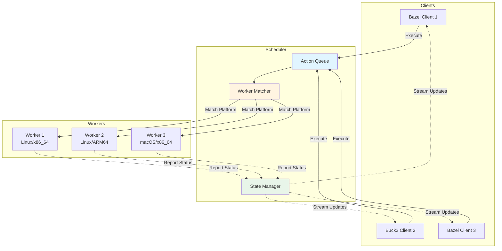
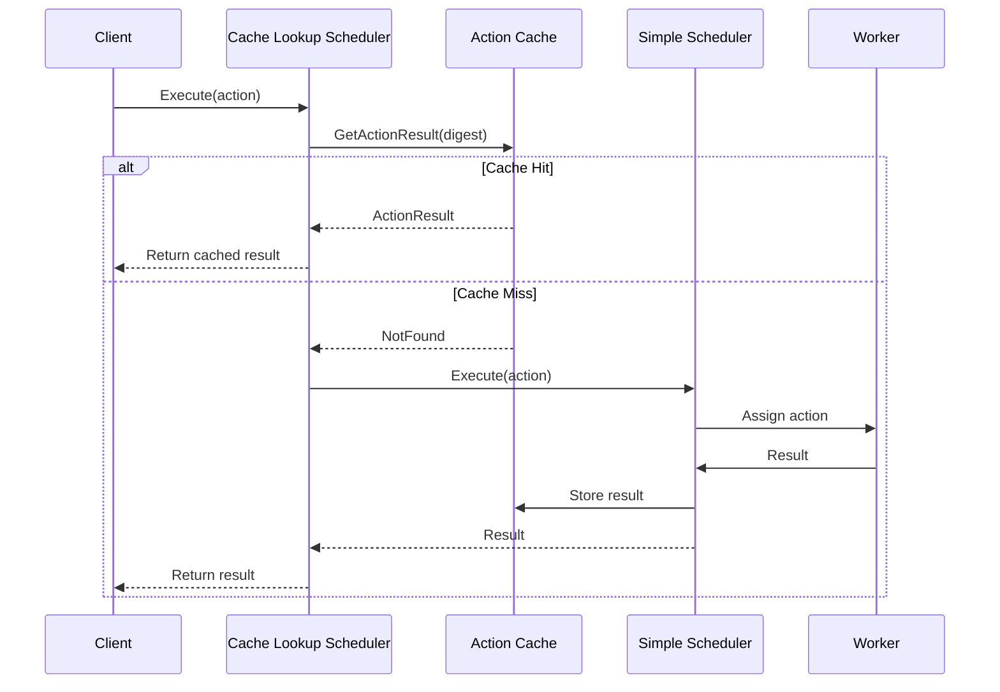
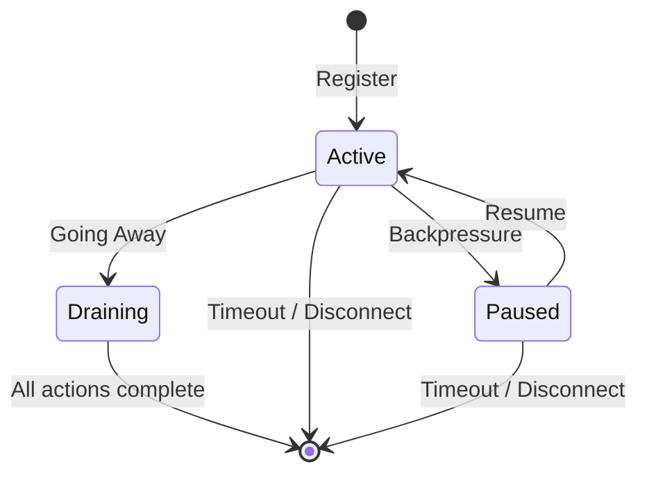

Schedulers are the orchestration layer in NativeLink that manage the lifecycle of build actions, match them to appropriate workers, and handle failures and retries. Understanding scheduler configuration is crucial for optimizing remote execution performance.

## Overview

The scheduler acts as the **central coordinator** between build clients and worker nodes:



**Responsibilities:**
- Accept execution requests from clients
- Queue actions awaiting workers
- Match actions to capable workers based on platform properties
- Monitor worker health and remove dead workers
- Handle action timeouts and retries
- Stream execution updates to clients

## Scheduler Types

NativeLink provides four scheduler implementations that can be composed for different deployment patterns.

### Simple Scheduler

The core scheduler implementation that manages worker pools and action execution.

```json
{
  "simple": {
    "supported_platform_properties": {
      "cpu_arch": "exact",
      "OSFamily": "exact",
      "cpu_count": "minimum",
      "memory_gb": "minimum"
    },
    "allocation_strategy": "least_recently_used",
    "retain_completed_for_s": 60,
    "client_action_timeout_s": 60,
    "worker_timeout_s": 5,
    "max_action_executing_timeout_s": 300,
    "max_job_retries": 3,
    "worker_match_logging_interval_s": 10
  }
}
```

#### Platform Properties

Defines how worker capabilities are matched to action requirements:

<Tabs>
  <Tab title="exact">
    Requires **exact string match** between action and worker property.
    
    **Example:**
    - Action: `cpu_arch: "arm64"`
    - Worker: `cpu_arch: "arm64"` ✓
    - Worker: `cpu_arch: "x86_64"` ✗
    
    **Use For:** OS family, CPU architecture, environment type
  </Tab>
  
  <Tab title="minimum">
    Worker must have **at least** the requested value (numeric comparison).
    
    **Example:**
    - Action: `cpu_count: "8"`
    - Worker: `cpu_count: "16"` ✓
    - Worker: `cpu_count: "4"` ✗
    
    **Use For:** CPU count, memory, disk space
  </Tab>
  
  <Tab title="priority">
    **Informational only**, does not restrict matching.
    
    **Example:**
    - Action: `pool: "high-priority"`
    - Worker: `pool: "standard"` ✓ (still matches)
    
    **Use For:** Soft preferences (future: worker selection hints)
  </Tab>
  
  <Tab title="ignore">
    Allows actions to request property without requiring workers to have it.
    
    **Example:**
    - Action: `experimental_feature: "enabled"`
    - Worker: (no property) ✓ (still matches)
    
    **Use For:** Optional capabilities, backward compatibility
  </Tab>
</Tabs>

**Configuration Example:**

```json
{
  "supported_platform_properties": {
    "cpu_arch": "exact",        // Must match exactly
    "OSFamily": "exact",        // Must match exactly
    "cpu_count": "minimum",     // Worker must have >= requested
    "memory_gb": "minimum",     // Worker must have >= requested
    "pool": "priority",         // Informational only
    "optional_gpu": "ignore"    // Actions can request, workers needn't have
  }
}
```

#### Allocation Strategies

Determines which worker is selected when multiple workers match:

<Accordion title="Allocation Strategy Details">
  <AccordionItem title="Least Recently Used (LRU)">
    **Default.** Prefers workers that have been idle longest.
    
    **Behavior:**
    - Distributes load evenly across all workers
    - Keeps all workers active
    - Prevents "hot spots" on specific workers
    
    **Best For:**
    - Uniform workloads
    - Maximizing cluster utilization
    - Preventing worker starvation
    
    ```json
    {
      "allocation_strategy": "least_recently_used"
    }
    ```
  </AccordionItem>
  
  <AccordionItem title="Most Recently Used (MRU)">
    Prefers workers that recently completed tasks.
    
    **Behavior:**
    - Concentrates load on "warm" workers
    - Increases cache hit rates on worker's local storage
    - May leave some workers idle
    
    **Best For:**
    - Workloads with high input reuse
    - Minimizing input download times
    - Workers with local caching
    
    ```json
    {
      "allocation_strategy": "most_recently_used"
    }
    ```
  </AccordionItem>
</Accordion>

#### Timeout Configuration

<CardGroup cols={2}>
  <Card title="Worker Timeout" icon="clock">
    ```json
    {
      "worker_timeout_s": 5
    }
    ```
    
    Remove workers that haven't sent keepalive in this duration.
    
    **Default:** 5 seconds
  </Card>
  
  <Card title="Client Action Timeout" icon="clock">
    ```json
    {
      "client_action_timeout_s": 60
    }
    ```
    
    Mark actions as failed if client doesn't update within this duration.
    
    **Default:** 60 seconds
  </Card>
  
  <Card title="Max Action Executing Timeout" icon="clock">
    ```json
    {
      "max_action_executing_timeout_s": 300
    }
    ```
    
    Timeout actions that execute without progress for this duration.
    
    **Default:** 0 (disabled)
    
    <Info>
      Set to 0 to rely only on worker keepalives.
    </Info>
  </Card>
  
  <Card title="Retain Completed" icon="clock">
    ```json
    {
      "retain_completed_for_s": 60
    }
    ```
    
    Keep completed actions in memory for late `WaitExecution` calls.
    
    **Default:** 60 seconds
  </Card>
</CardGroup>

#### Retry Configuration

```json
{
  "max_job_retries": 3
}
```

Actions that fail with **internal errors** or **timeouts** are automatically retried up to this limit on different workers.

<Warning>
  Actions that fail due to **user errors** (non-zero exit code) are **NOT retried**. Only infrastructure failures trigger retries.
</Warning>

**Retryable Failures:**
- Worker disconnection
- Internal server errors
- Network timeouts
- CAS upload/download failures

**Non-Retryable Failures:**
- Compilation errors (exit code 1)
- Test failures (exit code != 0)
- Missing input files
- Invalid action configuration

#### Backend Storage

Scheduler state can be persisted for high availability:

<Tabs>
  <Tab title="Memory (Default)">
    Stores all state in memory.
    
    ```json
    {
      "experimental_backend": null
    }
    ```
    
    **Pros:** Fast, simple
    
    **Cons:** Lost on restart
  </Tab>
  
  <Tab title="Redis (Experimental)">
    Persists state to Redis for durability.
    
    ```json
    {
      "experimental_backend": {
        "redis": {
          "redis_store": "SCHEDULER_REDIS"
        }
      }
    }
    ```
    
    **Pros:** Survives restarts, multi-scheduler support
    
    **Cons:** Added latency, requires Redis cluster
    
    <Warning>
      This is experimental and may have limitations.
    </Warning>
  </Tab>
</Tabs>

### Cache Lookup Scheduler

Wraps another scheduler with Action Cache checking.

```json
{
  "cache_lookup": {
    "ac_store": "AC_MAIN_STORE",
    "scheduler": {
      "simple": { ... }
    }
  }
}
```

**Behavior:**
1. Check Action Cache for existing result
2. If **cache hit**: Return cached result immediately
3. If **cache miss**: Forward to nested scheduler for execution
4. After execution: Store result in Action Cache



<Note>
  **Recommendation:** Use `CompletenessCheckingSpec` for the `ac_store` to ensure cached results reference existing CAS objects.
</Note>

### Property Modifier Scheduler

Modifies action platform properties before forwarding to nested scheduler.

```json
{
  "property_modifier": {
    "modifications": [
      {
        "add": {
          "name": "pool",
          "value": "production"
        }
      },
      {
        "remove": "legacy_flag"
      },
      {
        "replace": {
          "name": "cpu_arch",
          "value": "amd64",
          "new_name": "cpu_arch",
          "new_value": "x86_64"
        }
      }
    ],
    "scheduler": {
      "simple": { ... }
    }
  }
}
```

**Modification Types:**

<Tabs>
  <Tab title="Add">
    Add a new property to all actions.
    
    ```json
    {
      "add": {
        "name": "environment",
        "value": "production"
      }
    }
    ```
    
    **Use Cases:**
    - Route to specific worker pools
    - Add default properties
    - Tag actions for monitoring
  </Tab>
  
  <Tab title="Remove">
    Remove a property by name.
    
    ```json
    {
      "remove": "deprecated_property"
    }
    ```
    
    **Use Cases:**
    - Strip incompatible properties
    - Remove sensitive information
    - Clean up legacy flags
  </Tab>
  
  <Tab title="Replace">
    Replace property name and/or value.
    
    ```json
    {
      "replace": {
        "name": "cpu_arch",
        "value": "amd64",      // Optional: match this value
        "new_name": "cpu_arch",
        "new_value": "x86_64"  // Optional: keep same if omitted
      }
    }
    ```
    
    **Use Cases:**
    - Normalize property names
    - Translate between client/worker conventions
    - Conditional property modification
  </Tab>
</Tabs>

**Modification Order:** Modifications are applied **in order**, so later modifications can affect earlier ones.

### GRPC Scheduler

Forwards all requests to a remote scheduler via gRPC.

```json
{
  "grpc": {
    "endpoint": {
      "address": "grpc://remote-scheduler.example.com:50051",
      "concurrency_limit": 100,
      "connect_timeout_s": 30,
      "tcp_keepalive_s": 30,
      "http2_keepalive_interval_s": 30,
      "http2_keepalive_timeout_s": 20
    },
    "connections_per_endpoint": 5,
    "max_concurrent_requests": 1000,
    "retry": {
      "max_retries": 6,
      "delay": 0.3,
      "jitter": 0.5
    }
  }
}
```

**Configuration:**
- **endpoint**: Remote scheduler address and connection settings
- **connections_per_endpoint**: TCP connection pooling
- **max_concurrent_requests**: Limit in-flight requests
- **retry**: Retry behavior for transient failures

**Use Cases:**

<CardGroup cols={2}>
  <Card title="Hybrid Deployments" icon="cloud">
    Local CAS caching with remote execution cluster.
    
    Clients upload to local CAS, scheduler forwards execution to remote cluster.
  </Card>
  
  <Card title="Multi-Region" icon="globe">
    Regional schedulers forward to global scheduler.
    
    Reduces latency while maintaining centralized worker pool.
  </Card>
  
  <Card title="Development" icon="laptop-code">
    Local developer builds use remote shared scheduler.
    
    Developers get remote execution without running full cluster.
  </Card>
  
  <Card title="Federation" icon="network-wired">
    Multiple independent clusters with cross-cluster fallback.
    
    Primary cluster handles most work, overflow to secondary.
  </Card>
</CardGroup>

## Scheduler Composition

Schedulers can be nested to create sophisticated routing and caching strategies:

### Example: Full-Featured Scheduler

```json
{
  "cache_lookup": {
    "ac_store": "AC_MAIN",
    "scheduler": {
      "property_modifier": {
        "modifications": [
          {
            "add": {
              "name": "cluster",
              "value": "prod-us-west"
            }
          }
        ],
        "scheduler": {
          "simple": {
            "supported_platform_properties": {
              "cpu_arch": "exact",
              "OSFamily": "exact",
              "cpu_count": "minimum"
            },
            "allocation_strategy": "least_recently_used",
            "max_job_retries": 3
          }
        }
      }
    }
  }
}
```

**Flow:**
1. **Cache Lookup**: Check AC for cached result
2. **Property Modifier**: Add cluster tag
3. **Simple Scheduler**: Match to workers and execute

## Worker Management

### Worker Registration

Workers connect to the scheduler and register their capabilities:

```protobuf
message ConnectWorkerRequest {
  string worker_id = 1;
  repeated Platform.Property platform_properties = 2;
}
```

**Platform Properties** advertised by worker:

```json
{
  "cpu_arch": "x86_64",
  "OSFamily": "linux",
  "cpu_count": "16",
  "memory_gb": "64",
  "pool": "production"
}
```

### Worker Health Monitoring

Scheduler monitors worker health via:

1. **Keepalive Messages**: Workers send periodic heartbeats
2. **Timeout Detection**: Workers not responding within `worker_timeout_s` are removed
3. **Backpressure**: Workers can signal they're full (paused state)
4. **Draining**: Workers can request graceful shutdown



### Worker Capacity

Workers declare maximum concurrent actions:

```json
{
  "max_inflight_tasks": 8
}
```

Scheduler tracks:
- **Running Actions**: Currently executing
- **Available Slots**: `max_inflight_tasks - running_actions`
- **Paused State**: No available slots (backpressure)

## Monitoring and Debugging

### Logging

Control scheduler logging verbosity:

```json
{
  "worker_match_logging_interval_s": 10
}
```

- **> 0**: Log worker matching events every N seconds
- **-1**: Disable worker matching logs

**Logs include:**
- "Worker busy" - All capable workers at capacity
- "Can't find any worker" - No workers match platform properties
- "Action assigned" - Successful worker assignment

### Metrics

Scheduler exposes Prometheus metrics:

- **Actions queued**: Number of actions awaiting workers
- **Actions executing**: Number of actions currently running
- **Actions completed**: Total completed actions
- **Workers connected**: Number of active workers
- **Worker timeouts**: Workers removed due to timeout
- **Action retries**: Number of retried actions

### Tracing

OpenTelemetry traces provide visibility into:

- Action queuing duration
- Worker matching time
- Execution duration
- Result upload time

## Best Practices

1. **Always use `cache_lookup` scheduler** in production to leverage Action Cache
2. **Configure platform properties** to match your worker heterogeneity
3. **Set appropriate timeouts** based on expected action duration
4. **Use LRU allocation** for most workloads unless you have specific caching needs
5. **Enable Redis backend** for multi-scheduler deployments or HA requirements
6. **Monitor worker health** and adjust `worker_timeout_s` for network conditions
7. **Tune `max_job_retries`** based on infrastructure reliability

## Troubleshooting

<Accordion title="Common Issues">
  <AccordionItem title="Actions stuck in queue">
    **Symptoms:** Actions remain queued indefinitely
    
    **Causes:**
    - No workers match platform properties
    - All workers at capacity
    - Workers disconnected/timed out
    
    **Solutions:**
    - Check worker platform properties match scheduler config
    - Verify workers are connected (`workers_connected` metric)
    - Increase worker pool or `max_inflight_tasks`
    - Check worker logs for connection issues
  </AccordionItem>
  
  <AccordionItem title="Frequent worker timeouts">
    **Symptoms:** Workers repeatedly disconnected
    
    **Causes:**
    - Network instability
    - Worker crashes
    - `worker_timeout_s` too aggressive
    
    **Solutions:**
    - Increase `worker_timeout_s` (e.g., 10-30s)
    - Check network latency between workers and scheduler
    - Review worker logs for crashes
    - Verify worker keepalive configuration
  </AccordionItem>
  
  <AccordionItem title="Actions timing out">
    **Symptoms:** Actions fail with timeout errors
    
    **Causes:**
    - Actions exceed timeout configuration
    - Workers hanging on specific actions
    
    **Solutions:**
    - Increase `max_action_executing_timeout_s`
    - Check worker logs for hung processes
    - Review action complexity (may need optimization)
    - Verify worker resources (CPU, memory, disk)
  </AccordionItem>
</Accordion>

## Next Steps

<CardGroup cols={3}>
  <Card title="Workers" icon="server" href="/concepts/workers">
    Configure and manage worker nodes
  </Card>
  <Card title="Remote Execution" icon="bolt" href="/concepts/remote-execution">
    Understand the execution flow
  </Card>
  <Card title="Architecture" icon="diagram-project" href="/concepts/architecture">
    See how schedulers fit in the system
  </Card>
</CardGroup>
