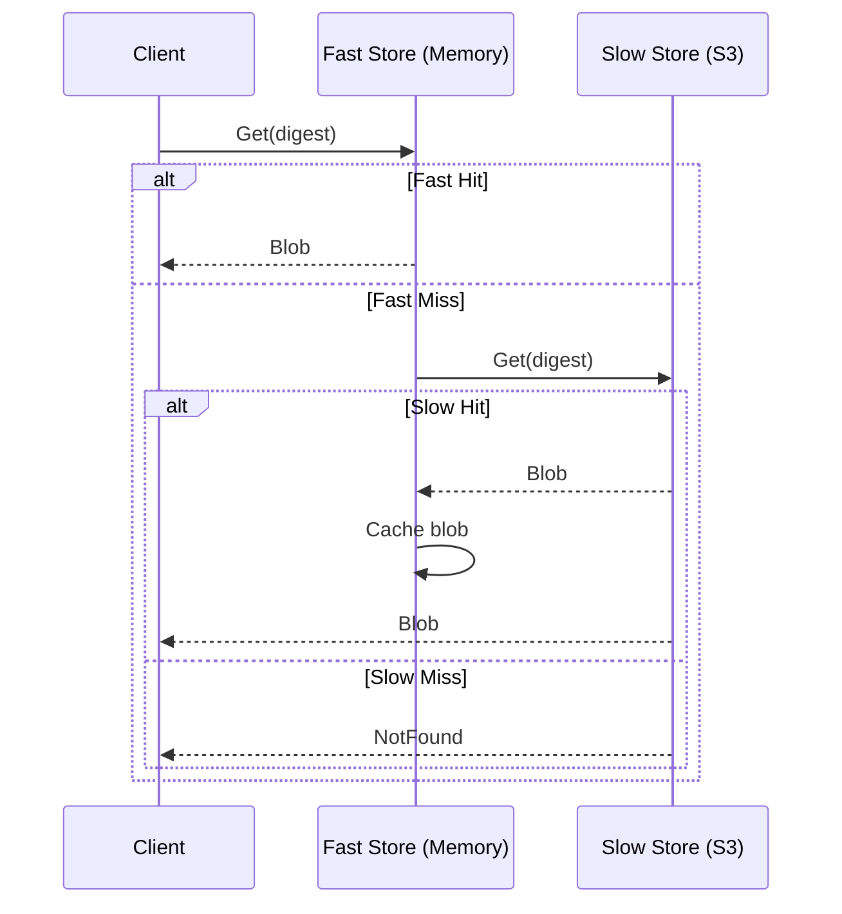

NativeLink provides a powerful and flexible storage abstraction that supports multiple backend types, composition strategies, and optimization layers. Stores are used for both **Content Addressable Storage (CAS)** and **Action Cache (AC)**.

## Store Types

NativeLink supports a wide variety of storage backends, each optimized for different use cases.

### Memory Store

Ultra-fast in-memory storage using hashmaps.

```json
{
  "memory": {
    "eviction_policy": {
      "max_bytes": "10gb"
    }
  }
}
```

<CardGroup cols={2}>
  <Card title="Pros" icon="check">
    - Extremely fast access
    - Zero latency
    - Simple configuration
  </Card>
  <Card title="Cons" icon="xmark">
    - Volatile (lost on restart)
    - Limited by available RAM
    - Not shared across machines
  </Card>
</CardGroup>

**Use Cases:**
- Fast local cache tier
- Development and testing
- Small projects

### Filesystem Store

Persistent disk-based storage.

```json
{
  "filesystem": {
    "content_path": "/var/cache/nativelink/cas",
    "temp_path": "/var/cache/nativelink/tmp",
    "eviction_policy": {
      "max_bytes": "100gb"
    },
    "block_size": 4096,
    "max_concurrent_writes": 100
  }
}
```

**Configuration:**
- **content_path**: Where blobs are stored permanently
- **temp_path**: Temporary location for uploads (must be on same filesystem for atomic moves)
- **block_size**: Filesystem block size (affects size calculations)
- **max_concurrent_writes**: Limit concurrent writes to prevent I/O saturation

<Info>
  On startup, the filesystem store scans `content_path` and rebuilds the index. Large stores may take time to initialize.
</Info>

**Use Cases:**
- Local persistent cache
- Single-node deployments
- CI runners with local disk

### Cloud Object Stores

Distributed cloud storage for sharing across machines.

<Tabs>
  <Tab title="Amazon S3">
    ```json
    {
      "experimental_cloud_object_store": {
        "provider": "aws",
        "region": "us-east-1",
        "bucket": "my-build-cache",
        "key_prefix": "nativelink/",
        "retry": {
          "max_retries": 6,
          "delay": 0.3,
          "jitter": 0.5
        },
        "multipart_max_concurrent_uploads": 10
      }
    }
    ```
    
    **Authentication**: Uses AWS credentials chain (environment variables, IAM roles, etc.)
  </Tab>
  
  <Tab title="Google Cloud Storage">
    ```json
    {
      "experimental_cloud_object_store": {
        "provider": "gcs",
        "bucket": "my-build-cache",
        "key_prefix": "nativelink/",
        "resumable_chunk_size": 2097152,
        "authentication_required": true
      }
    }
    ```
    
    **Authentication**: Uses Application Default Credentials (ADC)
  </Tab>
  
  <Tab title="NetApp ONTAP S3">
    ```json
    {
      "experimental_cloud_object_store": {
        "provider": "ontap",
        "endpoint": "https://ontap-s3.example.com:443",
        "vserver_name": "svm1",
        "bucket": "build-cache",
        "root_certificates": "/path/to/ca.pem",
        "key_prefix": "nativelink/"
      }
    }
    ```
    
    **Authentication**: Uses AWS-style environment variables (`AWS_ACCESS_KEY_ID`, `AWS_SECRET_ACCESS_KEY`)
  </Tab>
</Tabs>

**Common Options:**
- **key_prefix**: Namespace for objects (useful for multi-tenant buckets)
- **retry**: Configure retry behavior for transient failures
- **multipart_max_concurrent_uploads**: Parallel upload chunks for large files
- **consider_expired_after_s**: Treat objects older than this as expired (for external cleanup)

**Use Cases:**
- Distributed teams
- CI/CD pipelines
- Multi-region deployments
- Persistent shared cache

### Redis Store

Fast remote key-value storage.

```json
{
  "redis_store": {
    "addresses": [
      "redis://10.0.0.1:6379",
      "redis://10.0.0.2:6379"
    ],
    "mode": "cluster",
    "key_prefix": "nl:",
    "read_chunk_size": 65536,
    "max_client_permits": 500,
    "command_timeout_ms": 10000,
    "connection_timeout_ms": 3000
  }
}
```

**Modes:**
- **standard**: Single Redis instance
- **cluster**: Redis Cluster mode
- **sentinel**: Redis Sentinel for high availability

<Warning>
  Redis has object size limits (typically 256-512 MB). Use with `SizePartitioning` to handle large blobs.
</Warning>

**Use Cases:**
- Metadata storage
- Action Cache backend
- Small blob cache
- Scheduler backend (experimental)

### GRPC Store

Proxy to a remote NativeLink store via gRPC.

```json
{
  "grpc": {
    "instance_name": "main",
    "endpoints": [
      {
        "address": "grpc://remote-cas.example.com:50051",
        "concurrency_limit": 100
      }
    ],
    "store_type": "cas",
    "connections_per_endpoint": 5,
    "max_concurrent_requests": 1000
  }
}
```

**Use Cases:**
- Federated deployments
- Hybrid cloud setups
- Separating CAS from scheduler

### Noop Store

Discards all data (writes to /dev/null).

```json
{
  "noop": {}
}
```

**Use Cases:**
- Discarding large objects in size partitioning
- Testing configurations
- Debug scenarios

### Experimental Stores

<Accordion title="MongoDB Store">
  ```json
  {
    "experimental_mongo": {
      "connection_string": "mongodb://localhost:27017",
      "database": "nativelink",
      "cas_collection": "cas",
      "key_prefix": "cas:",
      "read_chunk_size": 65536,
      "max_concurrent_uploads": 10,
      "enable_change_streams": false
    }
  }
  ```
  
  **Use Cases**: Scheduler metadata, experimental CAS backend
</Accordion>

## Store Composition

NativeLink's power comes from **composing stores** to create sophisticated storage strategies.

### FastSlow Store

Two-tier caching with fast and slow backends.

```json
{
  "fast_slow": {
    "fast": {
      "memory": {
        "eviction_policy": { "max_bytes": "5gb" }
      }
    },
    "fast_direction": "both",
    "slow": {
      "experimental_cloud_object_store": {
        "provider": "aws",
        "bucket": "build-cache"
      }
    },
    "slow_direction": "both"
  }
}
```

**Behavior:**
- **Read**: Check fast store, fallback to slow, promote to fast on hit
- **Write**: Write to both stores simultaneously

**Directions:**
<Tabs>
  <Tab title="both">
    Normal operation for both reads and writes.
  </Tab>
  <Tab title="update">
    Only writes go to this store (not reads).
    
    **Use Case**: Write-only replication to slow store.
  </Tab>
  <Tab title="get">
    Only reads go to this store (not writes).
    
    **Use Case**: Read-only upstream cache.
  </Tab>
  <Tab title="read_only">
    Only reads, no writes.
    
    **Use Case**: Immutable upstream cache.
  </Tab>
</Tabs>



### Compression Store

Transparently compresses data before storing.

```json
{
  "compression": {
    "compression_algorithm": {
      "lz4": {
        "block_size": 65536,
        "max_decode_block_size": 262144
      }
    },
    "backend": {
      "filesystem": { ... }
    }
  }
}
```

**Algorithm: LZ4**
- Extremely fast compression/decompression
- Moderate compression ratio
- Ideal for network-backed stores

<Info>
  **Recommendation**: Use compression **before** network stores (S3, GCS) to reduce transfer costs and time.
</Info>

**When to Use:**
- ✅ Uncompressed build artifacts (executables, object files)
- ✅ Text files (logs, source code)
- ❌ Already compressed files (zips, jpegs, videos)

### Dedup Store

Content-defined chunking for efficient storage of similar files.

```json
{
  "dedup": {
    "index_store": {
      "memory": {
        "eviction_policy": { "max_bytes": "1gb" }
      }
    },
    "content_store": {
      "compression": {
        "compression_algorithm": { "lz4": {} },
        "backend": { "filesystem": { ... } }
      }
    },
    "min_size": 65536,
    "normal_size": 262144,
    "max_size": 524288
  }
}
```

**How it Works:**
1. Splits input into **variable-size chunks** using rolling hash
2. Computes hash of each chunk
3. Stores unique chunks in `content_store`
4. Stores chunk index in `index_store`

**Benefits:**
- Deduplicate similar files (e.g., slightly modified binaries)
- Reduce storage for incremental changes
- Efficient delta-like storage

<Warning>
  **Do NOT** use dedup store as the backend of a compression store. Always compress the content_store, not the input.
</Warning>

**Ideal For:**
- Large binaries with small changes
- Docker layers
- Compiled artifacts with incremental updates

### Shard Store

Distribute load across multiple backend stores.

```json
{
  "shard": {
    "stores": [
      {
        "store": { "filesystem": { "content_path": "/mnt/disk1" } },
        "weight": 1
      },
      {
        "store": { "filesystem": { "content_path": "/mnt/disk2" } },
        "weight": 1
      },
      {
        "store": { "filesystem": { "content_path": "/mnt/disk3" } },
        "weight": 2
      }
    ]
  }
}
```

**Sharding**: Uses digest hash to deterministically select a store.

**Weights**: Higher weight = more data routed to that store.

**Use Cases:**
- Distribute across multiple disks
- Load balancing
- Gradual migration between stores

### Size Partitioning Store

Route objects to different stores based on size.

```json
{
  "size_partitioning": {
    "size": "128mib",
    "lower_store": {
      "redis_store": { ... }
    },
    "upper_store": {
      "experimental_cloud_object_store": { ... }
    }
  }
}
```

**Behavior:**
- Objects **< 128 MiB** → `lower_store` (Redis)
- Objects **≥ 128 MiB** → `upper_store` (S3)

<Info>
  **Use Case**: Redis for small blobs (fast), S3 for large blobs (scalable).
</Info>

<Warning>
  Only use on **CAS stores** where size is accurate. Do not use on AC stores.
</Warning>

### Verify Store

Validate uploads to prevent corruption.

```json
{
  "verify": {
    "backend": { "memory": { ... } },
    "verify_size": true,
    "verify_hash": true
  }
}
```

**Checks:**
- **verify_size**: Ensure uploaded size matches digest size
- **verify_hash**: Recompute hash and verify it matches digest

<CardGroup cols={2}>
  <Card title="CAS Stores" icon="check">
    **Enable both** `verify_size` and `verify_hash`
    
    Prevents corrupt data from entering the cache.
  </Card>
  <Card title="AC Stores" icon="xmark">
    **Disable both** checks
    
    Action results are not content-addressed.
  </Card>
</CardGroup>

### Completeness Checking Store

Ensure AC results reference existing CAS objects.

```json
{
  "completeness_checking": {
    "backend": {
      "filesystem": { ... }
    },
    "cas_store": {
      "ref_store": { "name": "CAS_MAIN_STORE" }
    }
  }
}
```

**Validation**: Before returning an ActionResult, verify all output digests exist in the CAS.

<Info>
  **Strongly recommended** for AC stores to prevent incomplete cache hits.
</Info>

### Existence Cache Store

Cache `has()` calls to reduce latency.

```json
{
  "existence_cache": {
    "backend": { "grpc": { ... } },
    "eviction_policy": {
      "max_seconds": 3600
    }
  }
}
```

**Use Case**: Reduce repeated existence checks to slow backends (S3, remote gRPC).

<Warning>
  Only use on **CAS stores**. Not suitable for AC stores.
</Warning>

### Ref Store

Reference a named store from the global store manager.

```json
{
  "stores": {
    "CAS_MAIN": {
      "filesystem": { ... }
    },
    "AC": {
      "completeness_checking": {
        "backend": { ... },
        "cas_store": {
          "ref_store": { "name": "CAS_MAIN" }
        }
      }
    }
  }
}
```

**Use Case**: Share stores across multiple configurations without duplication.

## Eviction Policies

Control when data is removed from stores.

```json
{
  "eviction_policy": {
    "max_bytes": "100gb",        // Start evicting when size exceeds
    "evict_bytes": "10gb",       // Evict until size is 90gb
    "max_seconds": 604800,       // Evict items older than 7 days
    "max_count": 1000000         // Evict when item count exceeds
  }
}
```

**Strategy**: Least Recently Used (LRU)

**Triggers**: Eviction starts when **any** limit is reached.

<Info>
  Setting `evict_bytes` creates a **low watermark** to prevent thrashing when near the limit.
</Info>

## Advanced Patterns

### Three-Tier Cache

```json
{
  "fast_slow": {
    "fast": {
      "memory": { "eviction_policy": { "max_bytes": "2gb" } }
    },
    "slow": {
      "fast_slow": {
        "fast": {
          "filesystem": { "eviction_policy": { "max_bytes": "50gb" } }
        },
        "slow": {
          "experimental_cloud_object_store": { "provider": "aws" }
        }
      }
    }
  }
}
```

**Tiers:**
1. **Memory** (2 GB) - Ultra-fast
2. **Filesystem** (50 GB) - Fast local persistent
3. **S3** (Unlimited) - Slow shared cloud

### Compressed Cloud Storage

```json
{
  "compression": {
    "compression_algorithm": { "lz4": {} },
    "backend": {
      "experimental_cloud_object_store": {
        "provider": "gcs",
        "bucket": "build-cache"
      }
    }
  }
}
```

**Benefits:**
- Reduce network transfer time
- Lower cloud storage costs
- Faster uploads/downloads

### Partitioned Redis + S3

```json
{
  "size_partitioning": {
    "size": "256mib",
    "lower_store": {
      "redis_store": { "addresses": ["redis://cache:6379"] }
    },
    "upper_store": {
      "compression": {
        "compression_algorithm": { "lz4": {} },
        "backend": {
          "experimental_cloud_object_store": { "provider": "aws" }
        }
      }
    }
  }
}
```

**Strategy:**
- Small blobs (< 256 MB) in Redis for speed
- Large blobs (≥ 256 MB) in compressed S3 for scalability

## Best Practices

1. **CAS Configuration**:
   - Use `verify` store with both checks enabled
   - Consider `compression` for network stores
   - Use `fast_slow` for multi-tier caching

2. **AC Configuration**:
   - Use `completeness_checking` to ensure integrity
   - Disable `verify_size` and `verify_hash`
   - Keep AC smaller and faster than CAS

3. **Production Deployments**:
   - Use cloud storage (S3/GCS) for shared CAS
   - Local fast tier (memory/filesystem) for performance
   - Compression to reduce costs
   - Eviction policies to prevent unbounded growth

4. **Performance**:
   - Memory > Filesystem > Redis > S3/GCS (latency)
   - Use `existence_cache` for slow backends
   - Set `max_concurrent_writes` on filesystem stores

## Next Steps

<CardGroup cols={2}>
  <Card title="Build Cache" icon="database" href="/concepts/build-cache">
    Learn how CAS and AC work together
  </Card>
  <Card title="Architecture" icon="diagram-project" href="/concepts/architecture">
    Understand the full system design
  </Card>
</CardGroup>
