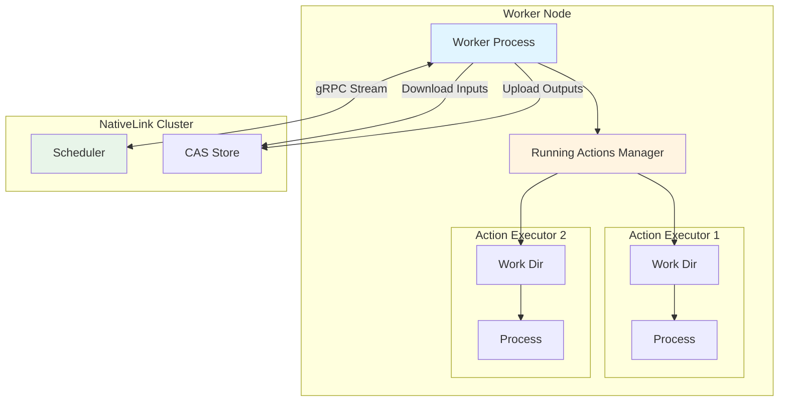
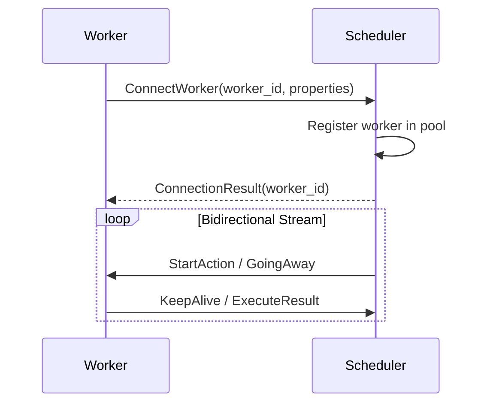
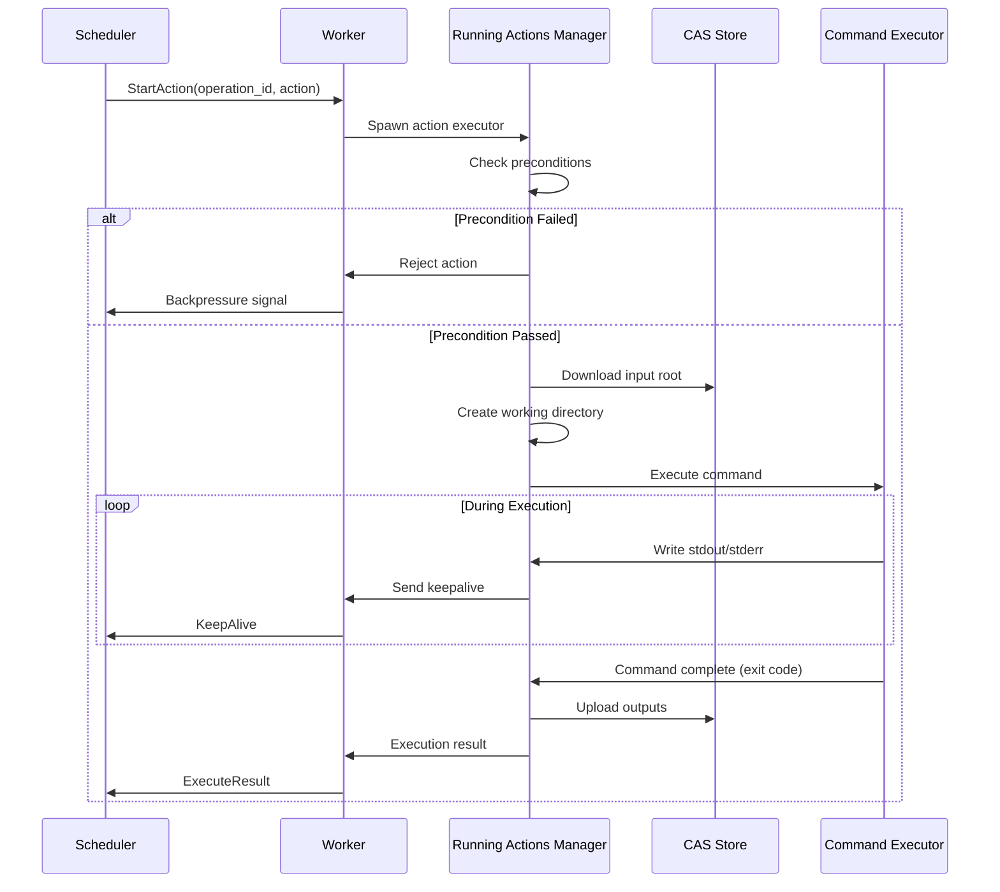

Workers are the execution engines of NativeLink that run build and test actions submitted by clients through the scheduler. They download inputs from CAS, execute commands in isolated environments, and upload outputs back to CAS.

## Overview

Workers form a pool of computational resources that:

- **Connect** to the scheduler and advertise their capabilities
- **Receive** action assignments based on platform property matching
- **Download** input files from Content Addressable Storage (CAS)
- **Execute** commands in clean, isolated working directories
- **Upload** output artifacts back to CAS
- **Report** execution results to the scheduler



## Worker Lifecycle

### 1. Connection and Registration

When a worker starts, it connects to the scheduler:



**Worker Registration:**

```protobuf
message ConnectWorkerRequest {
  string worker_id = 1;  // Unique identifier for this worker
  repeated Platform.Property platform_properties = 2;
}
```

**Platform Properties** advertise the worker's capabilities:

```json
{
  "cpu_arch": "x86_64",
  "OSFamily": "linux",
  "cpu_count": "16",
  "memory_gb": "64",
  "disk_gb": "500",
  "pool": "production",
  "container-image": "docker://ubuntu:22.04"
}
```

<Info>
  Platform properties must match the scheduler's `supported_platform_properties` configuration for the worker to receive matching actions.
</Info>

### 2. Receiving Actions

The scheduler assigns actions to workers via the bidirectional stream:

```protobuf
message UpdateForWorker {
  oneof update {
    StartExecute start_action = 1;
    GoingAwayRequest going_away = 2;
  }
}
```

**StartExecute** contains:
- **operation_id**: Unique identifier for this execution
- **action_digest**: Hash of the Action proto
- **action_info**: Expanded action details (command, inputs, timeout)

### 3. Action Execution

The **Running Actions Manager** handles concurrent action execution:



#### Precondition Checks

Before accepting an action, workers can run a **precondition script**:

```json
{
  "precondition_script": "/usr/local/bin/check-resources.sh"
}
```

**Purpose:**
- Verify sufficient disk space
- Check required tools are installed
- Confirm GPU availability
- Validate license server connectivity

**Behavior:**
- **Exit 0**: Accept the action
- **Non-zero exit**: Reject the action (worker signals backpressure)

<Warning>
  Precondition scripts run **before each action**. Keep them fast (< 1 second) to avoid delaying execution.
</Warning>

#### Working Directory Setup

Each action executes in a **clean, isolated directory**:

1. **Create** temporary working directory (e.g., `/tmp/nativelink/<operation_id>`)
2. **Download** input root from CAS
3. **Materialize** directory tree structure
4. **Set** environment variables
5. **Execute** command
6. **Capture** stdout/stderr and exit code
7. **Upload** outputs to CAS
8. **Delete** working directory

<Note>
  This ensures **hermetic execution** - actions cannot interfere with each other or be affected by previous executions.
</Note>

#### Command Execution

The worker executes the command specified in the Action:

```protobuf
message Command {
  repeated string arguments = 1;              // e.g., ["gcc", "-c", "main.c"]
  repeated EnvironmentVariable env = 2;       // Environment variables
  repeated string output_files = 3;           // Expected output files
  repeated string output_directories = 4;     // Expected output directories
  Platform platform = 5;                      // Platform properties
  string working_directory = 6;               // Working directory (relative to root)
}
```

**Execution:**
- Spawns process with specified arguments
- Sets environment variables
- Captures stdout and stderr
- Enforces timeout
- Monitors for completion

**Timeouts:**
- **Action timeout**: Specified in Action proto or worker default
- **Upload timeout**: Maximum time to upload outputs

<Warning>
  If an action exceeds its timeout, the process is killed and the action is marked as failed.
</Warning>

#### Output Collection

After successful execution:

1. **Identify** output files/directories specified in Command
2. **Hash** each output file (compute digest)
3. **Upload** outputs to CAS
4. **Create** ActionResult proto with output digests
5. **Upload** stdout/stderr to CAS
6. **Report** result to scheduler

### 4. Keepalive and Health

Workers send periodic **keepalive** messages:

```protobuf
message KeepAliveRequest {
  string worker_id = 1;
}
```

**Purpose:**
- Signal the worker is still alive
- Prevent scheduler from timing out the worker
- Update last-seen timestamp

**Frequency:** Every few seconds (configurable)

<Info>
  If the scheduler doesn't receive a keepalive within `worker_timeout_s`, the worker is removed from the pool.
</Info>

### 5. Graceful Shutdown

Workers can gracefully drain:

1. Worker receives shutdown signal (SIGTERM)
2. Worker sends **GoingAway** to scheduler
3. Scheduler stops assigning new actions
4. Worker completes running actions
5. Worker disconnects

```protobuf
message GoingAwayRequest {
  string worker_id = 1;
}
```

## Worker Configuration

### Basic Configuration

```json
{
  "worker_api_endpoint": {
    "address": "grpc://scheduler.example.com:50051"
  },
  "cas_stores": {
    "CAS_MAIN": {
      "grpc": {
        "instance_name": "main",
        "endpoints": [{
          "address": "grpc://cas.example.com:50051"
        }],
        "store_type": "cas"
      }
    }
  },
  "platform_properties": {
    "cpu_arch": "x86_64",
    "OSFamily": "linux",
    "cpu_count": "16",
    "memory_gb": "64"
  },
  "max_inflight_tasks": 8,
  "timeout": "1200s",
  "upload_timeout": "600s",
  "work_directory": "/tmp/nativelink"
}
```

### Configuration Options

<Accordion title="Worker Settings">
  <AccordionItem title="worker_api_endpoint">
    **Scheduler connection endpoint.**
    
    ```json
    {
      "worker_api_endpoint": {
        "address": "grpc://scheduler:50051",
        "tls_config": {
          "ca_file": "/etc/nativelink/ca.pem",
          "cert_file": "/etc/nativelink/worker.pem",
          "key_file": "/etc/nativelink/worker-key.pem"
        }
      }
    }
    ```
    
    **TLS Configuration** (optional):
    - `ca_file`: Certificate authority to verify scheduler
    - `cert_file`: Client certificate for mutual TLS
    - `key_file`: Private key for client certificate
  </AccordionItem>
  
  <AccordionItem title="cas_stores">
    **CAS backends for input download and output upload.**
    
    ```json
    {
      "cas_stores": {
        "CAS_FAST": {
          "fast_slow": {
            "fast": {
              "filesystem": {
                "content_path": "/var/cache/nativelink/cas",
                "temp_path": "/var/cache/nativelink/tmp",
                "eviction_policy": { "max_bytes": "50gb" }
              }
            },
            "slow": {
              "grpc": {
                "instance_name": "main",
                "endpoints": [{ "address": "grpc://cas:50051" }],
                "store_type": "cas"
              }
            }
          }
        }
      }
    }
    ```
    
    <Info>
      Using a local cache tier (filesystem or memory) reduces network traffic for frequently accessed inputs.
    </Info>
  </AccordionItem>
  
  <AccordionItem title="platform_properties">
    **Advertised worker capabilities.**
    
    Common properties:
    - `cpu_arch`: `x86_64`, `arm64`, `aarch64`
    - `OSFamily`: `linux`, `darwin`, `windows`
    - `cpu_count`: Number of CPU cores
    - `memory_gb`: Available RAM in gigabytes
    - `disk_gb`: Available disk space
    - `pool`: Worker pool name (`production`, `ci`, `dev`)
    - `container-image`: Docker image for containerized execution
    
    <Warning>
      Platform properties must match the scheduler's `supported_platform_properties` configuration.
    </Warning>
  </AccordionItem>
  
  <AccordionItem title="max_inflight_tasks">
    **Maximum concurrent actions.**
    
    ```json
    {
      "max_inflight_tasks": 8
    }
    ```
    
    **Guideline:**
    - Set to number of CPU cores for CPU-bound tasks
    - Set lower for memory-intensive tasks
    - Set to `0` for unlimited (not recommended)
    
    <Info>
      When all slots are full, the worker signals **backpressure** to the scheduler and stops accepting new actions.
    </Info>
  </AccordionItem>
  
  <AccordionItem title="timeout">
    **Default action execution timeout.**
    
    ```json
    {
      "timeout": "1200s"
    }
    ```
    
    **Default:** 1200 seconds (20 minutes)
    
    Actions can specify their own timeout, which takes precedence.
  </AccordionItem>
  
  <AccordionItem title="upload_timeout">
    **Maximum time to upload action outputs.**
    
    ```json
    {
      "upload_timeout": "600s"
    }
    ```
    
    **Default:** 600 seconds (10 minutes)
    
    Prevents workers from hanging on failed uploads.
  </AccordionItem>
  
  <AccordionItem title="work_directory">
    **Root directory for temporary working directories.**
    
    ```json
    {
      "work_directory": "/tmp/nativelink"
    }
    ```
    
    Each action creates a subdirectory under this path.
    
    <Warning>
      Ensure sufficient disk space and fast I/O (preferably SSD).
    </Warning>
  </AccordionItem>
  
  <AccordionItem title="precondition_script">
    **Optional script to run before accepting actions.**
    
    ```json
    {
      "precondition_script": "/usr/local/bin/check-worker-health.sh"
    }
    ```
    
    **Example script:**
    ```bash
    #!/bin/bash
    # Check available disk space
    available=$(df /tmp | tail -1 | awk '{print $4}')
    if [ $available -lt 10485760 ]; then  # Less than 10GB
      echo "Insufficient disk space"
      exit 1
    fi
    exit 0
    ```
  </AccordionItem>
</Accordion>

## Advanced Features

### Multi-Worker CAS

Workers can share a local CAS to reduce redundant downloads:

```json
{
  "cas_stores": {
    "SHARED_LOCAL_CAS": {
      "fast_slow": {
        "fast": {
          "filesystem": {
            "content_path": "/shared/nativelink/cas",
            "temp_path": "/shared/nativelink/tmp",
            "eviction_policy": { "max_bytes": "200gb" }
          }
        },
        "slow": {
          "grpc": { ... }
        }
      }
    }
  }
}
```

**Benefits:**
- Multiple workers on the same machine share cached inputs
- Reduces network traffic to remote CAS
- Faster action startup (inputs already local)

### Directory Caching

Workers maintain a cache of downloaded directory trees to avoid re-downloading:

- **Digest-based cache**: Directories indexed by digest
- **LRU eviction**: Old directories removed when cache is full
- **Atomic updates**: Directories fully downloaded before use

### Resource Monitoring

Workers can monitor resource usage and reject actions when resources are constrained:

**Metrics:**
- CPU usage
- Memory usage
- Disk space
- Network I/O

**Integration:** Use precondition scripts to check resources before accepting actions.

## Running Workers

### Standalone Worker

```bash
nativelink \n  --config worker-config.json \n  --worker
```

### Worker Pool (Multiple Workers on One Machine)

```bash
# Start 4 workers with different IDs
for i in {1..4}; do
  nativelink \
    --config worker-config.json \
    --worker \
    --worker-id "worker-$HOSTNAME-$i" &
done
```

### Systemd Service

```ini
[Unit]
Description=NativeLink Worker
After=network.target

[Service]
Type=simple
User=nativelink
Group=nativelink
ExecStart=/usr/local/bin/nativelink /etc/nativelink/worker.json
Restart=always
RestartSec=10

[Install]
WantedBy=multi-user.target
```

### Docker Container

```dockerfile
FROM ghcr.io/tracemachina/nativelink:latest

COPY worker-config.json /config.json

CMD ["nativelink", "/config.json"]
```

### Kubernetes Deployment

```yaml
apiVersion: apps/v1
kind: Deployment
metadata:
  name: nativelink-worker
spec:
  replicas: 10
  selector:
    matchLabels:
      app: nativelink-worker
  template:
    metadata:
      labels:
        app: nativelink-worker
    spec:
      containers:
      - name: worker
        image: ghcr.io/tracemachina/nativelink:latest
        args: ["/config/worker.json"]
        volumeMounts:
        - name: config
          mountPath: /config
        - name: cache
          mountPath: /var/cache/nativelink
        resources:
          requests:
            cpu: "8"
            memory: "32Gi"
          limits:
            cpu: "16"
            memory: "64Gi"
      volumes:
      - name: config
        configMap:
          name: worker-config
      - name: cache
        emptyDir:
          sizeLimit: 100Gi
```

## Monitoring Workers

### Metrics

Workers expose Prometheus metrics:

- **Actions completed**: Total actions executed
- **Actions failed**: Failed action count
- **Action duration**: Execution time histogram
- **Download bytes**: Total input download volume
- **Upload bytes**: Total output upload volume
- **Working directory size**: Current disk usage

### Logging

Workers log execution details:

- Action received and started
- Input download progress
- Command execution (stdout/stderr)
- Output upload progress
- Execution result (success/failure)
- Errors and warnings

**Log Levels:**
- `ERROR`: Critical failures
- `WARN`: Retryable issues (network errors, timeouts)
- `INFO`: Action lifecycle events
- `DEBUG`: Detailed execution traces
- `TRACE`: Low-level protocol details

## Troubleshooting

<Accordion title="Common Issues">
  <AccordionItem title="Worker not receiving actions">
    **Symptoms:** Worker connects but remains idle.
    
    **Causes:**
    - Platform properties don't match any actions
    - All action slots full (`max_inflight_tasks`)
    - Worker paused due to backpressure
    
    **Solutions:**
    - Verify platform properties match scheduler config
    - Check worker metrics for `actions_running`
    - Review precondition script (if configured)
    - Ensure scheduler has queued actions
  </AccordionItem>
  
  <AccordionItem title="Actions timing out">
    **Symptoms:** Actions fail with timeout errors.
    
    **Causes:**
    - Actions exceed configured timeout
    - Worker resources exhausted (CPU, memory)
    - Long input download times
    
    **Solutions:**
    - Increase `timeout` configuration
    - Check worker resource usage (CPU, memory, disk)
    - Optimize CAS configuration (add local cache tier)
    - Review action complexity (may need optimization)
  </AccordionItem>
  
  <AccordionItem title="Input download failures">
    **Symptoms:** Actions fail during input download.
    
    **Causes:**
    - Missing blobs in CAS
    - Network connectivity issues
    - CAS backend failures
    
    **Solutions:**
    - Verify blobs exist in CAS (check client uploads)
    - Test network connectivity to CAS endpoint
    - Review CAS store logs for errors
    - Check CAS store configuration
  </AccordionItem>
  
  <AccordionItem title="Output upload failures">
    **Symptoms:** Actions complete but fail to upload outputs.
    
    **Causes:**
    - Network issues to CAS
    - CAS storage full or rejecting uploads
    - Upload timeout too short
    
    **Solutions:**
    - Increase `upload_timeout`
    - Check CAS backend capacity
    - Review network stability
    - Check CAS logs for upload errors
  </AccordionItem>
  
  <AccordionItem title="Worker disconnects frequently">
    **Symptoms:** Worker repeatedly loses connection to scheduler.
    
    **Causes:**
    - Network instability
    - Scheduler restarts
    - Worker crashes
    - Keepalive timeout too aggressive
    
    **Solutions:**
    - Check network stability between worker and scheduler
    - Review worker logs for crashes or errors
    - Verify scheduler is stable
    - Increase scheduler's `worker_timeout_s`
  </AccordionItem>
</Accordion>

## Best Practices

1. **Size worker pool** based on expected workload and machine resources
2. **Use local CAS cache** (filesystem or memory) to reduce network traffic
3. **Configure precondition scripts** for dynamic resource checks
4. **Set appropriate timeouts** based on typical action duration
5. **Monitor metrics** to track worker health and performance
6. **Use graceful shutdown** to avoid killing in-progress actions
7. **Allocate sufficient disk space** for working directories
8. **Run workers on fast storage** (SSDs) for better I/O performance

## Next Steps

<CardGroup cols={3}>
  <Card title="Schedulers" icon="gears" href="/concepts/schedulers">
    Configure scheduler to manage workers
  </Card>
  <Card title="Remote Execution" icon="bolt" href="/concepts/remote-execution">
    Understand the execution flow
  </Card>
  <Card title="Stores" icon="database" href="/concepts/stores">
    Optimize CAS configuration
  </Card>
</CardGroup>
