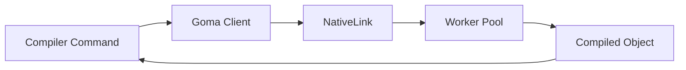

NativeLink supports any build tool that implements the Remote Execution API. This guide covers integration with additional build tools beyond Bazel, Buck2, and Reclient.

## Pants Build

Pants is a modern build system that supports remote caching and execution through the Remote Execution API.

### Configuration

<Steps>
  <Step title="Configure pants.toml">
    Add remote execution settings to your `pants.toml`:

    ```toml pants.toml
    [GLOBAL]
    remote_execution = true
    remote_store_address = "grpc://localhost:50051"
    remote_execution_address = "grpc://localhost:50051"
    remote_instance_name = "main"

    # Optional: Specify platform properties
    remote_execution_extra_platform_properties = [
      "OSFamily=linux",
      "cpu_arch=x86_64",
    ]
    ```
  </Step>

  <Step title="Enable remote caching">
    For cache-only mode (no remote execution):

    ```toml pants.toml
    [GLOBAL]
    remote_cache_read = true
    remote_cache_write = true
    remote_store_address = "grpc://localhost:50051"
    remote_instance_name = "main"
    ```
  </Step>

  <Step title="Run Pants build">
    ```bash
    pants test ::
    ```
  </Step>
</Steps>

### Authentication

<Tabs>
  <Tab title="mTLS">
    ```toml pants.toml
    [GLOBAL]
    remote_store_address = "grpcs://cache.example.com:50051"
    remote_ca_certs_path = "/path/to/ca.crt"
    remote_client_certs_path = "/path/to/client.crt"
    remote_client_key_path = "/path/to/client.key"
    ```
  </Tab>

  <Tab title="Headers">
    ```toml pants.toml
    [GLOBAL]
    remote_store_address = "grpc://cache.example.com:50051"
    remote_store_headers = { "x-api-key" = "your-api-key" }
    remote_execution_headers = { "x-api-key" = "your-api-key" }
    ```
  </Tab>
</Tabs>

### Platform Properties

Specify execution requirements:

```toml pants.toml
[GLOBAL]
remote_execution_extra_platform_properties = [
  "OSFamily=linux",
  "cpu_arch=x86_64",
  "cpu_count=4",
  "memory_kb=8000000",
]
```

## Goma

Goma is Google's distributed compiler system, primarily used for Chromium builds. NativeLink provides compatibility with Goma's protocol.

### Overview

Goma acts as a compiler proxy, distributing compilation tasks across multiple workers:



### Configuration

<Steps>
  <Step title="Set Goma environment variables">
    ```bash
    export GOMA_SERVER_HOST="localhost"
    export GOMA_SERVER_PORT="50051"
    export GOMA_USE_SSL="false"
    export GOMA_ARBITRARY_TOOLCHAIN_SUPPORT="true"
    ```
  </Step>

  <Step title="Configure compiler paths">
    ```bash
    export GOMA_CC="gcc"
    export GOMA_CXX="g++"
    ```
  </Step>

  <Step title="Start Goma client">
    ```bash
    goma_ctl.py ensure_start
    ```
  </Step>

  <Step title="Build with Goma">
    ```bash
    # Chromium example
    gn gen out/Release --args='use_goma=true'
    ninja -C out/Release -j200 chrome
    ```
  </Step>
</Steps>

### NativeLink Configuration for Goma

```json5 goma_config.json5
{
  stores: [
    {
      name: "CAS_STORE",
      filesystem: {
        content_path: "/tmp/nativelink/goma_cas",
        temp_path: "/tmp/nativelink/goma_tmp",
        eviction_policy: { max_bytes: "50gb" },
      },
    },
  ],
  schedulers: [
    {
      name: "GOMA_SCHEDULER",
      simple: {
        supported_platform_properties: {
          cpu_count: "minimum",
          OSFamily: "exact",
        },
      },
    },
  ],
  workers: [
    {
      local: {
        worker_api_endpoint: { uri: "grpc://127.0.0.1:50061" },
        cas_fast_slow_store: "CAS_STORE",
        work_directory: "/tmp/nativelink/goma_work",
        platform_properties: {
          cpu_count: { values: ["32"] },
          OSFamily: { values: ["linux"] },
        },
      },
    },
  ],
  servers: [
    {
      name: "public",
      listener: { http: { socket_address: "0.0.0.0:50051" } },
      services: {
        cas: [{ instance_name: "main", cas_store: "CAS_STORE" }],
        execution: [
          {
            instance_name: "main",
            cas_store: "CAS_STORE",
            scheduler: "GOMA_SCHEDULER",
          },
        ],
        bytestream: [{ instance_name: "main", cas_store: "CAS_STORE" }],
      },
    },
  ],
}
```

## Android Soong

Soong is the build system for the Android platform, supporting remote execution for Android system builds.

### Configuration

<Steps>
  <Step title="Configure RBE settings">
    Create or update `rbe_config.json`:

    ```json rbe_config.json
    {
      "exec_strategy": "remote",
      "server_address": "localhost:50051",
      "instance": "main",
      "use_application_default_credentials": false,
      "platform": {
        "OSFamily": "linux",
        "container-image": "android-build"
      }
    }
    ```
  </Step>

  <Step title="Set environment variables">
    ```bash
    export USE_RBE=true
    export RBE_server_address="localhost:50051"
    export RBE_instance="main"
    export RBE_exec_strategy="remote"
    ```
  </Step>

  <Step title="Build Android">
    ```bash
    source build/envsetup.sh
    lunch aosp_arm64-eng
    m -j$(nproc)
    ```
  </Step>
</Steps>

### Platform Configuration

Specify Android build platform properties:

```json platform.json
{
  "platform": {
    "OSFamily": "linux",
    "cpu_arch": "x86_64",
    "container-image": "android-build-container",
    "docker-runtime": "runc",
    "Pool": "android"
  }
}
```

## Custom Remote Execution Clients

For custom build tools, implement the Remote Execution API client:

### Basic Implementation

```python example_client.py
import grpc
from build.bazel.remote.execution.v2 import (
    remote_execution_pb2,
    remote_execution_pb2_grpc
)

def execute_remotely(command, inputs, output_files):
    # Connect to NativeLink
    channel = grpc.insecure_channel('localhost:50051')
    stub = remote_execution_pb2_grpc.ExecutionStub(channel)

    # Create action
    action = remote_execution_pb2.Action(
        command_digest=upload_command(command),
        input_root_digest=upload_inputs(inputs),
        output_files=output_files,
    )

    # Execute
    request = remote_execution_pb2.ExecuteRequest(
        instance_name='main',
        action_digest=upload_action(action),
    )

    response = stub.Execute(request)
    return handle_response(response)
```

### Required API Endpoints

Implement the following Remote Execution API services:

<CodeGroup>
```proto Execution
service Execution {
  rpc Execute(ExecuteRequest) returns (stream Operation);
  rpc WaitExecution(WaitExecutionRequest) returns (stream Operation);
}
```

```proto ContentAddressableStorage
service ContentAddressableStorage {
  rpc FindMissingBlobs(FindMissingBlobsRequest)
    returns (FindMissingBlobsResponse);
  rpc BatchUpdateBlobs(BatchUpdateBlobsRequest)
    returns (BatchUpdateBlobsResponse);
  rpc BatchReadBlobs(BatchReadBlobsRequest)
    returns (BatchReadBlobsResponse);
}
```

```proto ActionCache
service ActionCache {
  rpc GetActionResult(GetActionResultRequest)
    returns (ActionResult);
  rpc UpdateActionResult(UpdateActionResultRequest)
    returns (ActionResult);
}
```
</CodeGroup>

## Testing Integration

<Steps>
  <Step title="Start NativeLink">
    ```bash
    nativelink config.json5
    ```
  </Step>

  <Step title="Verify connectivity">
    ```bash
    grpcurl -plaintext localhost:50051 list
    ```

    Expected output:
    ```
    build.bazel.remote.execution.v2.ActionCache
    build.bazel.remote.execution.v2.ContentAddressableStorage
    build.bazel.remote.execution.v2.Execution
    grpc.health.v1.Health
    ```
  </Step>

  <Step title="Test with your build tool">
    Run a simple build and verify remote execution:

    ```bash
    # Check NativeLink logs for execution requests
    tail -f /var/log/nativelink/nativelink.log
    ```
  </Step>
</Steps>

## Common Configuration Patterns

### Multi-tenant Setup

Use instance names to separate different projects:

```json5
{
  servers: [
    {
      services: {
        cas: [
          { instance_name: "project-a", cas_store: "CAS_PROJECT_A" },
          { instance_name: "project-b", cas_store: "CAS_PROJECT_B" },
        ],
      },
    },
  ],
}
```

### Build Tool-Specific Workers

Configure workers with specific capabilities:

```json5
{
  workers: [
    {
      local: {
        platform_properties: {
          "build-tool": { values: ["pants"] },
          "python-version": { values: ["3.11"] },
        },
      },
    },
    {
      local: {
        platform_properties: {
          "build-tool": { values: ["soong"] },
          "android-sdk": { values: ["33"] },
        },
      },
    },
  ],
}
```

## Troubleshooting

### Unsupported platform properties

Ensure NativeLink scheduler supports your platform properties:

```json5
{
  schedulers: [
    {
      simple: {
        supported_platform_properties: {
          "your-custom-property": "exact",
        },
      },
    },
  ],
}
```

### Protocol version mismatches

Verify your client uses Remote Execution API v2:

```bash
grpcurl -plaintext localhost:50051 \
  describe build.bazel.remote.execution.v2.Execution
```

## Next Steps

- [Configure worker pools](/configuration/workers)
- [Set up authentication](/deployment-examples/authentication)
- [Monitor performance](/deployment-examples/metrics)
- [Remote Execution API Specification](https://github.com/bazelbuild/remote-apis)
