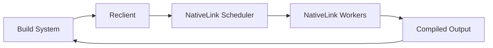

Reclient is Google's open-source remote execution client, designed as a successor to Goma. NativeLink provides full compatibility with Reclient through the Remote Execution API.

## Prerequisites

- Reclient installed (download from [bazelbuild/reclient](https://github.com/bazelbuild/reclient))
- A running NativeLink instance (see [Quickstart](/quickstart))
- A supported build system (Make, CMake, Ninja, etc.)

## Overview

Reclient acts as a wrapper around your compiler, intercepting compilation commands and executing them remotely through NativeLink's Remote Execution API.



## Installation

<Steps>
  <Step title="Download Reclient">
    ```bash
    # Download the latest release
    wget https://github.com/bazelbuild/reclient/releases/download/v0.x.x/reclient-linux-x86_64.tar.gz
    tar -xzf reclient-linux-x86_64.tar.gz
    ```
  </Step>

  <Step title="Set up environment">
    ```bash
    export RECLIENT_DIR=/path/to/reclient
    export PATH="$RECLIENT_DIR:$PATH"
    ```
  </Step>

  <Step title="Verify installation">
    ```bash
    rewrapper --version
    ```
  </Step>
</Steps>

## Configuration

Reclient is configured through environment variables and configuration files.

### Basic Configuration

Create a configuration file for Reclient:

```toml reproxy.cfg
# Server configuration
server_address = "localhost:50051"

# Instance name for multi-tenant setups
instance = "main"

# Disable authentication for local development
use_application_default_credentials = false
use_gce_credentials = false

# Logging
log_dir = "/tmp/reclient_logs"
log_format = "text"

# Cache directory
cache_dir = "/tmp/reclient_cache"

# Number of concurrent actions
num_local_workers = 8
num_remote_workers = 50
```

### Environment Variables

<Tabs>
  <Tab title="Basic Setup">
    ```bash
    # Reclient configuration
    export RBE_service="localhost:50051"
    export RBE_instance="main"
    export RBE_use_application_default_credentials=false
    export RBE_use_gce_credentials=false

    # Log directory
    export RBE_log_dir="/tmp/reclient_logs"
    export RBE_cache_dir="/tmp/reclient_cache"
    ```
  </Tab>

  <Tab title="Production Setup">
    ```bash
    # Production server
    export RBE_service="cache.example.com:50051"
    export RBE_instance="production"

    # Enable TLS
    export RBE_use_application_default_credentials=true
    export RBE_server_auth=true

    # Performance tuning
    export RBE_num_remote_workers=100
    export RBE_num_local_workers=16

    # Logging
    export RBE_log_dir="/var/log/reclient"
    export RBE_log_format="json"
    ```
  </Tab>
</Tabs>

## Using Reclient

### Starting the Proxy

<Steps>
  <Step title="Start reproxy">
    The `reproxy` daemon manages communication with NativeLink:

    ```bash
    reproxy &
    REPROXY_PID=$!
    ```
  </Step>

  <Step title="Wrap your build">
    Use `rewrapper` to intercept compilation commands:

    ```bash
    # Direct compilation
    rewrapper --labels=type=compile --exec_root=$PWD \
      gcc -c hello.c -o hello.o

    # Or use with your build system
    make CC="rewrapper gcc" CXX="rewrapper g++"
    ```
  </Step>

  <Step title="Stop reproxy when done">
    ```bash
    kill $REPROXY_PID
    ```
  </Step>
</Steps>

### Build System Integration

<CodeGroup>
```bash Make
# Start reproxy
reproxy &
REPROXY_PID=$!

# Run make with rewrapper
make CC="rewrapper gcc" \
     CXX="rewrapper g++" \
     -j$(nproc)

# Stop reproxy
kill $REPROXY_PID
```

```bash CMake
# Start reproxy
reproxy &
REPROXY_PID=$!

# Configure CMake
cmake -DCMAKE_C_COMPILER_LAUNCHER=rewrapper \
      -DCMAKE_CXX_COMPILER_LAUNCHER=rewrapper \
      -B build

# Build
cmake --build build -j$(nproc)

# Stop reproxy
kill $REPROXY_PID
```

```bash Ninja
# Start reproxy
reproxy &
REPROXY_PID=$!

# Generate build files with compiler wrapper
CC="rewrapper gcc" CXX="rewrapper g++" \
  ./configure

# Build with ninja
ninja -j$(nproc)

# Stop reproxy
kill $REPROXY_PID
```
</CodeGroup>

## NativeLink Server Configuration

Configure NativeLink to handle Reclient requests:

```json5 reclient_config.json5
{
  stores: [
    {
      name: "AC_STORE",
      filesystem: {
        content_path: "/tmp/nativelink/ac",
        temp_path: "/tmp/nativelink/ac_tmp",
        eviction_policy: { max_bytes: "5gb" },
      },
    },
    {
      name: "CAS_STORE",
      filesystem: {
        content_path: "/tmp/nativelink/cas",
        temp_path: "/tmp/nativelink/cas_tmp",
        eviction_policy: { max_bytes: "20gb" },
      },
    },
  ],
  schedulers: [
    {
      name: "MAIN_SCHEDULER",
      simple: {
        supported_platform_properties: {
          cpu_count: "minimum",
          cpu_arch: "exact",
          OSFamily: "exact",
        },
      },
    },
  ],
  workers: [
    {
      local: {
        worker_api_endpoint: { uri: "grpc://127.0.0.1:50061" },
        cas_fast_slow_store: "CAS_STORE",
        upload_action_result: { ac_store: "AC_STORE" },
        work_directory: "/tmp/nativelink/work",
        platform_properties: {
          cpu_count: { values: ["16"] },
          cpu_arch: { values: ["x86_64"] },
        },
      },
    },
  ],
  servers: [
    {
      name: "public",
      listener: { http: { socket_address: "0.0.0.0:50051" } },
      services: {
        cas: [{ instance_name: "main", cas_store: "CAS_STORE" }],
        ac: [{ instance_name: "main", ac_store: "AC_STORE" }],
        execution: [
          {
            instance_name: "main",
            cas_store: "CAS_STORE",
            scheduler: "MAIN_SCHEDULER",
          },
        ],
        capabilities: [
          {
            instance_name: "main",
            remote_execution: { scheduler: "MAIN_SCHEDULER" },
          },
        ],
        bytestream: [{ instance_name: "main", cas_store: "CAS_STORE" }],
      },
    },
  ],
}
```

## Advanced Configuration

### Platform Properties

Specify execution requirements through platform properties:

```bash
# Require specific CPU count
rewrapper --labels=type=compile \
  --platform=OSFamily=linux \
  --platform=cpu_count=4 \
  --exec_root=$PWD \
  gcc -c hello.c -o hello.o
```

### Input/Output Specifications

Explicitly declare inputs and outputs for better caching:

```bash
rewrapper --labels=type=link \
  --inputs=hello.o,world.o \
  --output_files=hello \
  --exec_root=$PWD \
  gcc hello.o world.o -o hello
```

### Diagnostics

Enable detailed logging for troubleshooting:

```bash
export RBE_log_dir="/tmp/reclient_logs"
export RBE_log_format="text"
export RBE_v=2  # Verbose logging
```

## Testing Your Configuration

<Steps>
  <Step title="Start NativeLink">
    ```bash
    nativelink reclient_config.json5
    ```
  </Step>

  <Step title="Start reproxy with diagnostics">
    ```bash
    export RBE_v=1
    reproxy &
    REPROXY_PID=$!
    ```
  </Step>

  <Step title="Run a test compilation">
    ```bash
    echo 'int main() { return 0; }' > test.c
    rewrapper --labels=type=compile \
      --exec_root=$PWD \
      gcc -c test.c -o test.o
    ```
  </Step>

  <Step title="Check logs">
    ```bash
    ls -la /tmp/reclient_logs/
    cat /tmp/reclient_logs/reproxy_*.INFO
    ```
  </Step>

  <Step title="Stop reproxy">
    ```bash
    kill $REPROXY_PID
    ```
  </Step>
</Steps>

## Monitoring

Reclient provides metrics through its log files:

```bash
# View compilation statistics
grep -E "LocalMetadata|RemoteMetadata" /tmp/reclient_logs/reproxy_*.INFO

# Check cache hit rate
grep "CacheHit" /tmp/reclient_logs/reproxy_*.INFO
```

## Troubleshooting

### Connection refused

Verify NativeLink is running:

```bash
grpcurl -plaintext localhost:50051 list
```

### Actions failing remotely

Check worker logs and ensure toolchains are available on workers:

```bash
# Check reproxy logs
tail -f /tmp/reclient_logs/reproxy_*.ERROR
```

### Cache misses

Ensure exec_root is set correctly and inputs are properly specified:

```bash
rewrapper --compare=true --labels=type=compile \
  --exec_root=$PWD gcc -c test.c
```

## Next Steps

- [Configure custom toolchains](/configuration/toolchains)
- [Set up monitoring](/deployment-examples/metrics)
- [Deploy to production](/deployment-examples/kubernetes)
