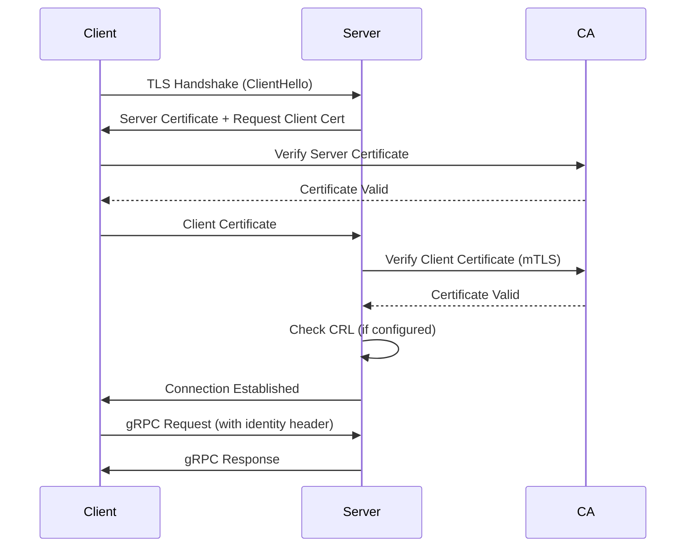

NativeLink supports multiple authentication approaches to secure your remote execution and caching infrastructure.

## Client Identity Headers

NativeLink can extract client identity from HTTP headers for tracking and authorization purposes.

### Configuration

Configure identity headers at the server level:

```json5
{
  servers: [
    {
      listener: {
        http: {
          socket_address: "0.0.0.0:50051"
        }
      },
      experimental_identity_header: {
        header_name: "x-identity",  // Default header name
        required: false              // Set to true to reject requests without this header
      },
      services: {
        // ... service configuration
      }
    }
  ]
}
```

### Parameters

- **`header_name`** (optional): Name of the HTTP header containing the client identity
  - Default: `"x-identity"`
  - Example: `"x-nativelink-client-id"`

- **`required`** (optional): Whether the identity header must be present
  - Default: `false`
  - When `true`, requests without the header are rejected

<Note>
The identity header is primarily used for telemetry and observability. It integrates with NativeLink's OpenTelemetry layer to track requests by client.
</Note>

## mTLS Client Authentication

For production deployments, use mutual TLS (mTLS) to authenticate clients with certificates.

### Server-Side Configuration

Configure the server to require client certificates:

```json5
{
  servers: [
    {
      listener: {
        http: {
          socket_address: "0.0.0.0:50051",
          tls: {
            cert_file: "/path/to/server-cert.pem",
            key_file: "/path/to/server-key.pem",
            client_ca_file: "/path/to/client-ca.pem",      // Required for mTLS
            client_crl_file: "/path/to/revocation-list.pem" // Optional CRL
          }
        }
      },
      services: {
        // ... service configuration
      }
    }
  ]
}
```

### mTLS Parameters

- **`client_ca_file`** (optional): Path to the Certificate Authority (CA) file for validating client certificates
  - When set, the server requires clients to present valid certificates
  - Supports PEM format
  - Multiple CA certificates can be included in the same file

- **`client_crl_file`** (optional): Path to the Certificate Revocation List (CRL)
  - Lists revoked client certificates that should be rejected
  - Must be in PEM format
  - Only used when `client_ca_file` is configured

<Warning>
When `client_ca_file` is configured, **all** clients must present valid certificates signed by the CA. Connections without valid certificates will be rejected.
</Warning>

### Client-Side Configuration

Configure workers and GRPC stores to use client certificates:

```json5
{
  workers: [
    {
      local: {
        worker_api_endpoint: {
          uri: "grpcs://scheduler:50061",
          tls_config: {
            ca_file: "/path/to/ca-cert.pem",
            cert_file: "/path/to/client-cert.pem",
            key_file: "/path/to/client-key.pem"
          }
        },
        // ... other worker configuration
      }
    }
  ]
}
```

For GRPC store endpoints:

```json5
{
  stores: [
    {
      name: "remote_cas",
      grpc: {
        instance_name: "main",
        endpoints: [
          {
            address: "grpcs://cas-server:50051",
            tls_config: {
              ca_file: "/path/to/ca-cert.pem",
              cert_file: "/path/to/client-cert.pem",
              key_file: "/path/to/client-key.pem"
            }
          }
        ],
        store_type: "cas"
      }
    }
  ]
}
```

### Client TLS Parameters

- **`ca_file`** (optional): Path to the CA certificate for server verification
  - Required unless `use_native_roots` is enabled
  - Verifies the server's certificate chain

- **`cert_file`** (optional): Path to the client certificate for mTLS
  - Must be paired with `key_file`
  - Used for client authentication

- **`key_file`** (optional): Path to the client private key
  - Must be paired with `cert_file`
  - Supports PKCS8, PKCS1, and SEC1 formats

- **`use_native_roots`** (optional): Use system root certificates for server verification
  - Default: `false`
  - When enabled, `ca_file` is ignored
  - Useful for connecting to servers with certificates from public CAs

<Note>
When using mTLS, ensure certificate files are readable by the NativeLink process and protected with appropriate file system permissions (e.g., `chmod 600` for private keys).
</Note>

## Worker API Security

<Warning>
The Worker API service should **never** be exposed on the same port as client-facing services. Workers have elevated permissions and must be isolated.
</Warning>

### Recommended Setup

Run the Worker API on a separate, non-public port:

```json5
{
  servers: [
    {
      name: "public_cas",
      listener: {
        http: {
          socket_address: "0.0.0.0:50051",  // Public port
          tls: {
            cert_file: "/path/to/server-cert.pem",
            key_file: "/path/to/server-key.pem"
          }
        }
      },
      services: {
        cas: [{ instance_name: "main", cas_store: "main_cas" }],
        ac: [{ instance_name: "main", ac_store: "main_ac" }]
      }
    },
    {
      name: "worker_api",
      listener: {
        http: {
          socket_address: "127.0.0.1:50061",  // Internal/private port
          tls: {
            cert_file: "/path/to/server-cert.pem",
            key_file: "/path/to/server-key.pem",
            client_ca_file: "/path/to/worker-ca.pem"  // Require worker certificates
          }
        }
      },
      services: {
        worker_api: {
          scheduler: "main_scheduler"
        }
      }
    }
  ]
}
```

<Steps>
  <Step title="Separate ports">
    Configure Worker API on a different port (e.g., 50061) than client services (e.g., 50051)
  </Step>
  <Step title="Restrict access">
    Bind the Worker API to `127.0.0.1` or use firewall rules to limit access to trusted networks
  </Step>
  <Step title="Enable mTLS">
    Require client certificates (`client_ca_file`) for Worker API connections
  </Step>
  <Step title="Network segmentation">
    Use network policies or security groups to isolate worker traffic from client traffic
  </Step>
</Steps>

## Authentication Flow



## Best Practices

- Always use TLS in production environments
- Implement mTLS for Worker API endpoints
- Rotate certificates regularly (e.g., every 90 days)
- Store private keys securely with restricted file permissions
- Use separate CAs for workers and clients when possible
- Monitor certificate expiration dates
- Implement Certificate Revocation Lists (CRL) for compromised certificates
- Use strong key sizes (minimum 2048-bit RSA or 256-bit ECDSA)

## Troubleshooting

### Connection Refused

- Verify the server is listening on the correct address and port
- Check firewall rules allow traffic on the configured port
- Ensure the client is connecting to the correct endpoint

### Certificate Verification Failed

- Verify the CA certificate matches the certificate authority that signed the server/client certificate
- Check certificate expiration dates: `openssl x509 -in cert.pem -noout -dates`
- Ensure the certificate chain is complete
- Verify the certificate's common name (CN) or subject alternative name (SAN) matches the endpoint hostname

### mTLS Handshake Failed

- Confirm both `cert_file` and `key_file` are configured on the client
- Verify the client certificate is signed by the CA specified in `client_ca_file` on the server
- Check that the certificate is not in the CRL (`client_crl_file`)
- Ensure private key permissions are correct (readable by the NativeLink process)

### Identity Header Missing

- Verify the client is sending the configured header name
- If `required: true`, ensure all clients include the identity header
- Check proxy or load balancer configurations aren't stripping headers
